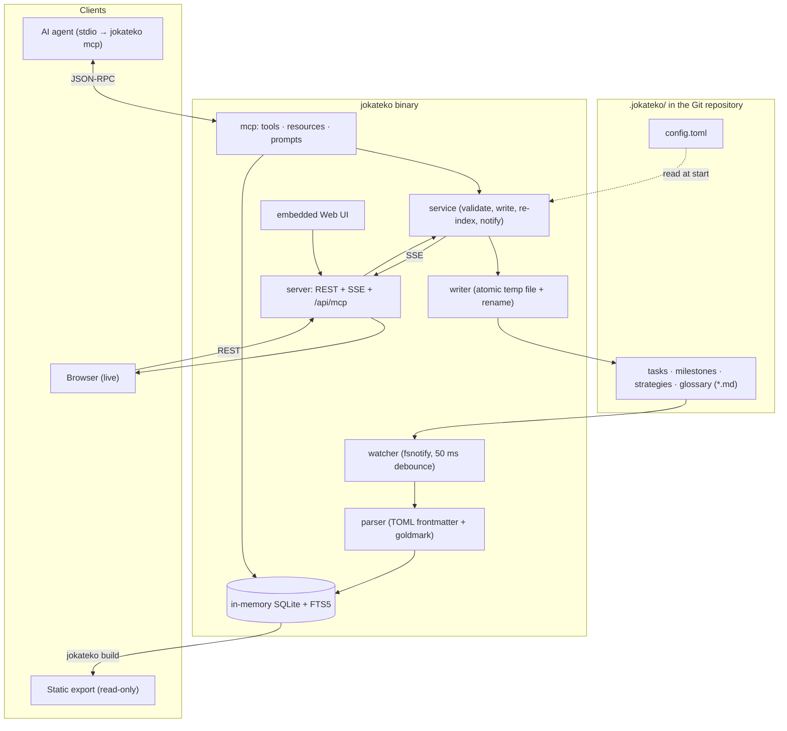

+++
title = 'Tasks-as-Code Architecture'
tier = 1
tags = ['docs', 'backend', 'frontend']
summary = 'Repository Markdown files are the only source of truth; a single zero-CGO Go binary indexes them into in-memory SQLite and serves them to humans (Web UI) and AI agents (MCP), writing changes back atomically.'
+++

# Tasks-as-Code Architecture

Jokateko is a local Kanban and knowledge base for human developers and AI agents. Tasks, milestones, strategies and glossary terms are Markdown files with TOML frontmatter inside the project's `.jokateko/` folder, committed to Git next to the code.

## Invariants

1. **Files are the source of truth.** Everything lives in `.jokateko/**/*.md` plus `.jokateko/config.toml`. No external database, no lockfiles, no hidden state. Everything is human-readable, diffable and mergeable.
2. **One-way sync: files → index → clients.** On start, every file is parsed into an in-memory SQLite database (query cache + FTS5 search). `fsnotify` keeps it current. The index is disposable and rebuilt on every launch.
3. **Every write goes through the service layer.** Web UI (REST) and agent (MCP) mutations share `internal/service`: validate → atomic file write → re-index → SSE broadcast. Nobody writes `.jokateko/` files around it (see *Agent guidance* in the glossary).
4. **Single static binary.** Pure Go, `CGO_ENABLED=0` (see *Pure Go Zero-CGO & Minimal Dependencies*). The Bun-built Web UI is embedded with `//go:embed`, so the binary has zero runtime dependencies on Linux, macOS and Windows.
5. **Agents are first-class users.** The MCP server is built in. `jokateko mcp` proxies to a running daemon or runs standalone. Strategies are tiered so agents load context progressively.
6. **One UI bundle, three modes.** The same `index.html` runs live against `serve`, as a read-only static export from `build`, or in browser-only client mode.
7. **Local and private by default.** The server binds `127.0.0.1` and has no authentication. Protection comes from loopback binding, Cross-Origin protection, a DNS-rebinding `Host` check and a hash-based CSP.

## High-level architecture

## Where to read next

| Topic | Strategy |
|---|---|
| Packages and data flow | Go packages and data flow (tier 2) |
| File and frontmatter formats | Workspace and entity file format (tier 2) |
| Browser app | Web UI architecture (tier 2) |
| Agents | MCP server and stdio proxy (tier 2), MCP tool catalog (tier 3) |
| HTTP | REST API and SSE (tier 3) |
| `jokateko parse` | Validation rules and parse output (tier 3) |
| Repository layout | Project Structure (tier 2) |
