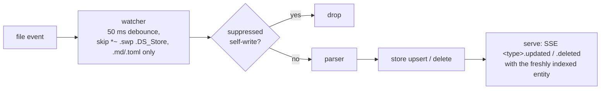

+++
title = 'Go packages and data flow'
tier = 2
tags = ['backend']
summary = 'Responsibilities and boundaries of the cmd/ and internal/ Go packages, the three data-flow pipelines (file ingest, UI mutation, MCP), and the concurrency rules that keep files, index and clients consistent.'
+++

# Go packages and data flow

Module `github.com/RJuho/jokateko`, Go 1.27+, `CGO_ENABLED=0`. All library code is in `internal/`, so nothing is importable from outside. Tests sit next to the code as `*_test.go`. The cross-package chaos test is in `tests/chaos/`.

## Packages

| Package | Owns | Must not |
|---|---|---|
| `cmd/jokateko` | CLI dispatch (`flag.FlagSet`, no CLI library): `serve`, `mcp`, `parse`/`lint`, `build`, `init`, `version`, `about`, `licenses`, `help`. Wires packages together. `SIGINT`/`SIGTERM` cancel the root context for graceful shutdown | contain business rules |
| `cmd/gentypes` | Generates `web/src/types/generated.ts` from `internal/model` | |
| `cmd/genlicenses` | Generates `internal/version/licenses.json` and `web/src/data/licenses.json` | |
| `internal/config` | Embedded `default.toml`, overlay merge with the project `config.toml`, `init` template, `CFG-*`/`TAG-*` validation, resolved paths (`config.Dirs`) | |
| `internal/model` | Domain types (Task, Milestone, Strategy, GlossaryTerm, BoardState, Snapshot, search, sort), frontmatter structs, milestone progress and auto-archive | do I/O |
| `internal/parser` | Split and decode `+++` TOML frontmatter, goldmark Markdown, checklist parsing, `## Completion Summary` and `## Notes` editing | |
| `internal/store` | In-memory SQLite (`modernc.org/sqlite`), DDL in `schema.sql`, sqlc queries, FTS5 search, board aggregation | be the source of truth |
| `internal/watcher` | `fsnotify` on the four entity dirs, 50 ms debounce, editor-artifact filter, ingest pipeline (parse → upsert/delete → callback) | write files |
| `internal/writer` | Atomic writes: temp file `.<name>.*.tmp` in the same dir → `fsync` → `chmod` → `rename`, plus a suppression cache so self-writes are not re-ingested | |
| `internal/validator` | Whole-project lint for `jokateko parse`: rules, DFS cycle detection, diagnostics | mutate |
| `internal/service` | **The only mutation path**, shared by REST and MCP: ID validation and allocation, status check, editable-state body lock, dependency existence and cycle checks (`AddTaskDependency`), the `CheckTags` helper, completion and note editing, then write → re-index → notify | |
| `internal/server` | `net/http` mux: REST, SSE hub, `/api/mcp` Streamable HTTP, embedded UI and Mermaid assets, security middleware | write files directly |
| `internal/mcp` | MCP server (official go-sdk): tools, resources, prompt, server instructions. Adds MCP-only guards before calling the service: tag vocabulary, archived-milestone (`reopen_milestone`), no `done` via `update_task_status`, `allow_mutations` | write files directly |
| `internal/proxy` | `jokateko mcp`: stdio ↔ daemon bridge with live failover to an in-process standalone server | |
| `internal/exporter` | `jokateko build`: snapshot JSON + Mermaid mode injected into the embedded `index.html` | |
| `internal/version` | Link-time version/commit/date, license data | |
| `web` (`embed.go`) | `//go:embed` of `web/dist` | |

Guards that should apply to every client belong in `service`, not in `mcp` or `server`. The MCP-only guards above are where they are for historical reasons. Move them down when you touch them.

## Pipelines

### 1. File ingest (external edits, `git pull`, branch switch)

Only the four entity directories are watched. **`config.toml` is read once at startup**, so restart `serve` (or `mcp`) after changing it.

### 2. Web UI mutation

Browser → REST handler → `service` (validate, take the mutation lock) → `writer` (atomic write, recorded in the suppression cache) → `store` re-index → SSE `<type>.created|updated|deleted` with the full entity. The watcher then sees the write but suppresses it, because content matches the recorded write within the TTL (3 s in `serve`, 1 s in standalone `mcp`).

### 3. MCP agent

Agent → stdio → `jokateko mcp` → either the daemon's `/api/mcp` (proxy mode) or an in-process server with its own store and watcher (standalone mode). Reads query `store`. Writes call the same `service` methods as REST, so agent changes appear live in the browser. See *MCP server and stdio proxy*.

## Concurrency rules

1. `service` serializes all mutations with one `sync.Mutex`, so concurrent REST and MCP read-modify-write cycles cannot lose updates.
2. `store` guards the SQLite handle with a `sync.RWMutex`. Readers never see a half-applied batch.
3. Files are never written partially: temp file + `fsync` + `rename` in the same directory.
4. Echo prevention is content-based. The suppression cache stores what was written, so a different external edit made within the TTL is still ingested.
5. SSE fan-out never blocks a mutation: `Broadcast` and per-client sends drop the event when buffers are full. A `ping` is sent every 15 s.
