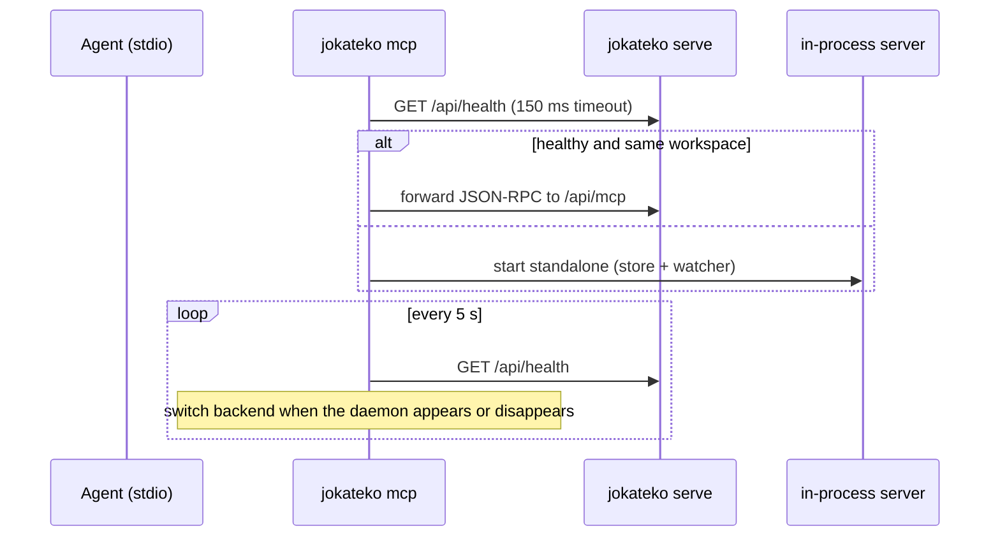

+++
title = 'MCP server and stdio proxy'
tier = 2
tags = ['api', 'backend']
summary = 'How Jokateko serves MCP: a stateless Streamable HTTP endpoint inside `serve`, and `jokateko mcp`, a stdio process that proxies to a same-workspace daemon or runs standalone, failing over live in both directions (including handshake replay) so agents survive daemon restarts and upgrades.'
+++

# MCP server and stdio proxy

`internal/mcp` builds one MCP server (official `modelcontextprotocol/go-sdk`) on top of `internal/service`. Two processes host it. The tool list is in *MCP tool catalog*.

## Goals

1. **Small context.** List and search tools return compact summaries. Full bodies come only from `get_*`. Strategies use tiered progressive disclosure.
2. **Same rules as the UI.** Every write tool calls the same `service` method as REST, so writes are validated, atomic, re-indexed and broadcast over SSE to open browsers.
3. **Agents never lose their session.** Starting, stopping or upgrading the daemon must not break an agent's stdio connection. This replaces the earlier "zero-downtime daemon migration" note.

## Hosts

| Host | Transport | Store |
|---|---|---|
| `jokateko serve` | Streamable HTTP at `/api/mcp` (GET/POST/DELETE), **stateless**, go-sdk DNS-rebinding protection on, behind the server's own Host and Cross-Origin checks | The daemon's store, watcher and SSE hub |
| `jokateko mcp` | stdio | Proxy to the daemon, **or** its own in-process store, watcher and suppression cache (standalone) |

## `jokateko mcp` failover

- A daemon is accepted only if `/api/health` reports the **same `workspace`** directory, so another project on the same port is ignored.
- Switches are serialized. A request that cannot be delivered during a switch gets a JSON-RPC error instead of being dropped silently.
- Standalone mode writes through the same `service` code, so a later `serve` sees its changes on disk.

## Handshake replay

The agent keeps one stdio session, but the backend can change underneath it. A new backend has never seen the agent's handshake.

| Client (as of go-sdk v1.8) | Handshake | Per-request `_meta` |
|---|---|---|
| Claude Code, go-sdk v1.8 `Client` | `server/discover` (SEP-2575, protocol `2026-07-28`), optionally `subscriptions/listen` | yes |
| Older clients | `initialize` + `notifications/initialized` | no |

| Backend | SEP-2575 client | Legacy client |
|---|---|---|
| Daemon (stateless HTTP) | no replay | no replay: each request gets a fresh pre-initialized session |
| Standalone (stateful) | no replay: session state comes from `_meta` | **replay required**, otherwise `method "tools/call" is invalid during session initialization` |

Rules:

1. Cache only the legacy `initialize` and `notifications/initialized`. Never cache `server/discover`.
2. Replay only when switching **to standalone**.
3. The replayed `initialize` uses a proxy-private ID `jokateko-proxy-replay-<n>`. The proxy waits up to 5 s for that response and swallows it, then sends the cached `notifications/initialized`.
4. Known limitation: a `subscriptions/listen` stream does not survive a switch. Jokateko's tool, prompt and resource lists never change while it runs, so nothing is lost.

## Server instructions (agent guidance)

The MCP `instructions` sent at handshake are `[mcp] instructions` from config (the default text tells agents to read tasks fully, tick criteria, use `complete_task`, read tier-1 strategies, and never edit `.jokateko/` directly). Then, for each column with `handled_by` or `instructions`, a line is appended under "Workflow Column Ownership & Instructions". The same column fields are returned by `get_board_state` and shown in the UI's column modal.

## Config switches

- `[mcp] enabled = false` turns MCP off entirely: `serve` mounts no handler, so `/api/mcp` answers `404`, and `jokateko mcp` exits with status 1 and "MCP is disabled". The REST API and Web UI are unaffected. Default `true`.
- `[mcp] allow_mutations = false` makes every write tool fail. Read tools keep working.
- There is no per-call timeout setting (the former `timeout_seconds` was never used and has been removed; a stale key in an existing config is ignored). Tool calls are short local file writes, bounded by the client's own request timeout.
