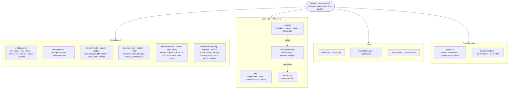
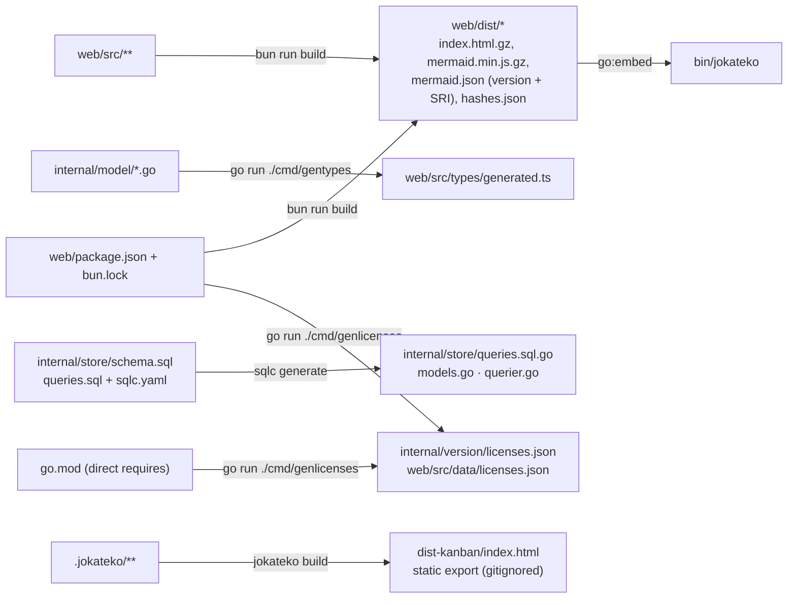

+++
title = 'Project Structure'
tier = 2
tags = ['backend', 'docs', 'frontend']
summary = 'Map of the most important folders, config files and generated artifacts in the Jokateko repository, and the rules for where new code, tests and configuration belong.'
+++

# Project Structure

Jokateko ships as **one pure-Go binary** (CLI, daemon, MCP server) that embeds a **Bun-built Preact UI**. The repository's `.jokateko/` folder dogfoods the tool itself and holds all project documentation as strategies and glossary terms. Package-level detail: *Go packages and data flow* and *Web UI architecture*. The user-facing `.jokateko/` layout: *Workspace and entity file format*.

## Directory map

## Generated artifacts and their sources

Never edit the right-hand side by hand. Change the source and regenerate.

`make generate` runs sqlc, gentypes and genlicenses. `make build` rebuilds `web/dist` when UI sources change, then compiles the binary. Because `web/dist` is generated and gitignored, `go install …@latest` cannot build Jokateko. Use `make build`.

## Key configuration files

| File | Purpose |
|---|---|
| `go.mod` / `go.sum` | Go module and locked dependencies (no CGO, see *Pure Go Zero-CGO & Minimal Dependencies*) |
| `web/package.json` / `web/bun.lock` | UI dependencies. The lockfile pins exact versions and integrity hashes, including Mermaid's CDN version and SRI |
| `Makefile` | Single entry point: `build`, `install`, `test`, `cover`, `e2e-test`, `lighthouse-test`, `generate`, `fuzz-*`, `chaos-test`, `cross-compile` |
| `.jokateko/config.toml` | This repo's Jokateko project config (columns, tags, server, CSP). Validate with `jokateko parse` |
| `internal/config/default.toml` | Compiled-in defaults and the reference config spec |
| `internal/store/sqlc.yaml` | sqlc code generation config |
| `web/biome.json` · `web/tsconfig.json` · `web/bunfig.toml` | UI lint and format, TypeScript, Bun dev-server Tailwind plugin |
| `playwright.config.ts` · `playwright.lighthouse.config.ts` · `tsconfig.json` (root) | E2E and Lighthouse suites, and typing for `tests/` |
| `.mcp.json` · `.agents/mcp_config.json` · `.claude/settings.json` · `skills-lock.json` | AI agent tooling: MCP servers (Jokateko, Playwright, Valibot, gopls) and skills |
| `README.md` · `AGENTS.md` (`CLAUDE.md` is a symlink) | User guide with the CLI reference; agent workflow rules |
| `.github/workflows/*.yml` · `.devcontainer/*` · `Dockerfile` | CI, devcontainer image and release builds |

## Rules

1. **Go code** lives in `internal/<package>/` (not importable from outside). Entry points only go in `cmd/`. Tests sit next to the code as `*_test.go`.
2. **UI code** lives in `web/src/`:
   - components by view (`components/board|calendar|strategies|glossary|modal|common`)
   - signals state in `state/`
   - Valibot schemas in `schemas/`
   - pure helpers in `utils/`
   - unit tests as `*.test.ts` next to the code
3. **E2E tests** go in `tests/e2e/*.spec.ts`, using `data-testid` selectors. Spec files are parsed as plain JS by the Bun-backed runner (no type annotations).
4. **`.jokateko/`** is mutated only through the Jokateko MCP tools or the UI. Never edit it directly.
5. **Documentation** lives in `.jokateko/strategies` and `.jokateko/glossary`, not in a `docs/` folder. The only root Markdown files are the README, contributor and security docs, and the agent instructions.
6. **Generated and build output** (`web/dist/`, `bin/`, `dist-kanban/`, `test-results/`, `playwright-report/`, `lighthouse-report/`) is gitignored. Regenerate it, never commit it.
7. **New dependencies** in `go.mod` or `web/package.json` need explicit human approval.
