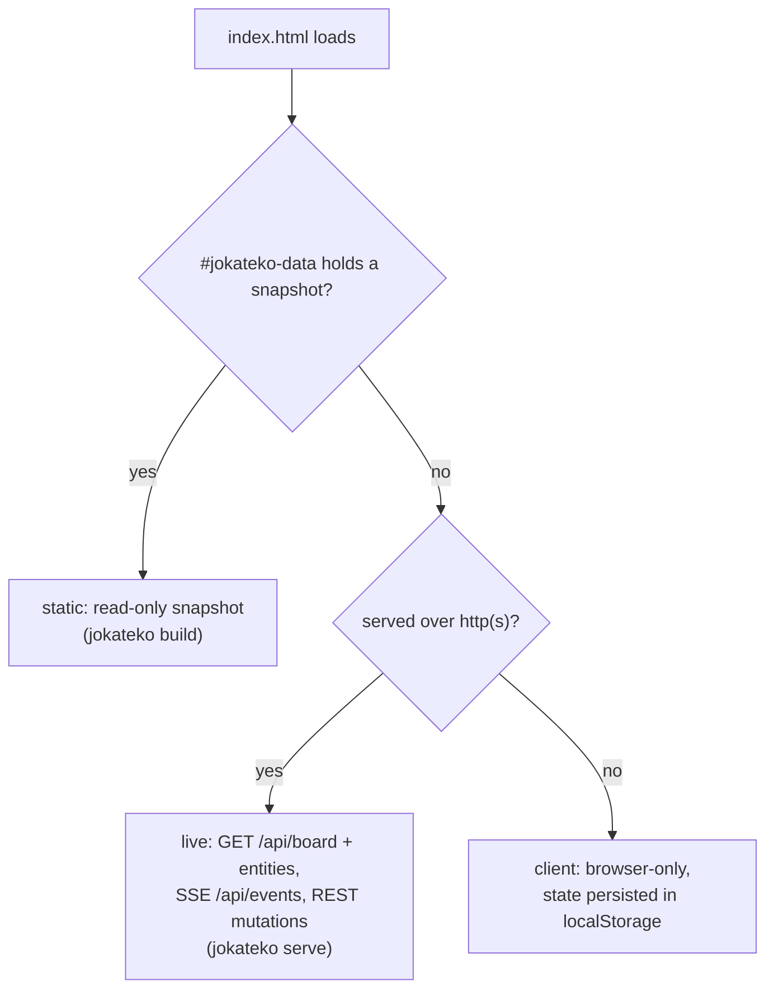

+++
title = 'Web UI architecture'
tier = 2
tags = ['frontend']
summary = 'One Preact bundle, built by Bun into a single self-contained index.html and embedded in the binary, boots in live, static or client mode; state is signals, all external data is validated with Valibot, Mermaid is lazy-loaded and SRI-pinned, and tests target data-testid.'
+++

# Web UI architecture

## Stack

Preact 11 + `@preact/signals`, Valibot, Tailwind CSS v4 + daisyUI 5 + `@tailwindcss/typography`, `lucide-preact` icons, Mermaid. Built with the Bun bundler. Lint and format with Biome (`bun run check`). Exact versions are in `web/package.json` and `web/bun.lock`, and new UI dependencies need human approval.

## One bundle, three modes

`web/scripts/bundle.ts` produces **one** `index.html` with the CSS and JS inlined. The same file serves every mode. `state/bootstrap.ts` chooses the mode at startup:

- **Snapshot injection.** The bundle contains ``. `serve` sends it untouched. `internal/exporter` replaces the placeholder with the snapshot JSON (tasks, milestones, strategies, glossary, UI-facing config). It first inserts the `jokateko-mermaid` meta, the optional inert Mermaid block and the CSP `<meta http-equiv>` into the template, so snapshot content can never match those markers. Go never builds the UI's HTML, CSS or JS; it only inserts these fixed tags.
- **Static** hides every edit control and shows the `mode-indicator-static` badge. Search, filters, routing and modals still work offline. **Client** shows `mode-indicator-client`, and **live** shows `mode-indicator-live`.
- **Live** reconnects SSE with backoff and applies `task|milestone|strategy|glossary.created|updated|deleted` events to the signal store. After a dropped connection it reloads the board and entities on reconnect, because events missed meanwhile are gone.
- A new UI-facing config field must reach **both** paths: `model.SnapshotConfig` (static) and `model.BoardState` from `/api/board` (live). See *UI translations and project locale*.

## Code layout (`web/src`)

| Path | Contents |
|---|---|
| `App.tsx`, `main.tsx`, `router.ts` | Boot, hash router |
| `components/board` | `KanbanBoard`, `Column`, `TaskCard`, `MilestoneCards` |
| `components/calendar` | Month and ISO-week calendar of `target_at` dates and milestone timeframes |
| `components/strategies`, `components/glossary` | Tiered strategy list, glossary |
| `components/modal` | Task detail/edit/create, column details, About + licenses |
| `components/common` | Header, FilterBar (search, tags, milestone, priority, sort), badges, footer, theme toggle, validation banner |
| `state/` | Signal store and its loaders (`fetchLiveBoard`, `fetchLiveEntities`), bootstrap, SSE client, localStorage persistence, theme |
| `schemas/models.ts` | Valibot schemas; the UI's types are inferred from them |
| `utils/` | i18n, dates (Intl), sorting, search, criteria parsing, Mermaid loader, `taskApi.ts` (task create/update with the archived-milestone confirmation) |
| `types/generated.ts` | Output of `cmd/gentypes` mirroring Go JSON (`make generate`). Not imported by app code |
| `types/drift.ts` | Type-level check that each Valibot schema has exactly the Go model's field names and accepts what Go sends (`generated.ts` assignable to the schema input). Run by `bun run typecheck`, which `make test` runs first, so schema drift fails the build |

Routes are hash-based deep links: `#board`, `#task/<id>`, `#milestone/<id>`, `#calendar[/YYYY-MM | /YYYY-Www][/task/<id> | /milestone/<id>]`, `#strategies`, `#strategy/<id>`, `#glossary`, `#glossary/<id>`.

## Rules

1. **Validate everything that comes from outside** (snapshot, REST, SSE, localStorage) with `v.safeParse`. On failure, show the non-fatal `validation-error-banner` and keep rendering whatever parsed. Never crash the board.
2. **Shared state lives in signals** in `state/store.ts`, and board and entity loading happens there. Today, task mutations (drag-and-drop in `KanbanBoard`; create, edit, notes and checkboxes in the modals) call `fetch` from the component and rely on SSE to refresh the store. Follow that pattern or move it into the store; do not add a third way. Task create and edit go through `utils/taskApi.ts` `saveTask`: on a `409` with `code: "milestone_archived"` it asks with `confirm()` and resends with `reopen_milestone: true`.
3. **Every testable element has a `data-testid`** (for example `task-card-<id>`, `column-<id>`, `task-detail-modal`, `search-input`, `mode-indicator-live`). Selectors in tests use only these.
4. **No inline handlers or remote assets.** Both `serve` (HTTP header) and static exports (`<meta http-equiv>`) carry the CSP from `internal/csp`, whose `script-src`/`style-src` contain the SHA-256 hashes of the inlined script and style. Those hashes come from the build-time ldflags values, or else are computed once from the embedded `index.html`. Anything that needs a new source must be added to `[server.security.csp]` deliberately.
5. **`body_html` is the only HTML from data**, inserted with `dangerouslySetInnerHTML` (task modal, strategies, glossary). That is safe only because `internal/parser` renders in goldmark safe mode: raw HTML is escaped and dangerous URLs are dropped. Never render other entity text as HTML.
6. **User-visible strings go through `t()`.** Dates go through Intl with `uiLocale()`. See *UI translations and project locale*.
7. The visual design is final. Accessibility fixes are markup-only.
8. **Schema changes go with Go model changes.** When `internal/model` changes, run `make generate` and update `schemas/models.ts` until `bun run typecheck` passes.

## Build output (`web/dist`, gitignored, embedded)

| File | Purpose |
|---|---|
| `index.html.gz` | The single-file app (gzip level 9), served with `Content-Encoding: gzip` when accepted |
| `hashes.json`, `script.sha256`, `style.sha256` | Build-time record of the inline script and style hashes |
| `mermaid.min.js.gz`, `mermaid.json` | Mermaid runtime and `{version, integrity}` |
| `bundled-packages.json` | Packages in the bundle, read by `cmd/genlicenses` |

`make ui-build` rebuilds only when `web/src`, `web/scripts`, `index.html`, `package.json` or `bun.lock` change. `bun run dev` (port 4321) serves the UI with hot reload and proxies `/api` to a running `jokateko serve` (`BACKEND_URL`).

## Mermaid (lazy, pinned, SRI-verified)

Mermaid is ~95 % of the JavaScript, so it is **not** in the app bundle. `utils/mermaidLoader.ts` loads it when the first diagram renders:

| Mode | Source | Verification | Extra CSP `script-src` |
|---|---|---|---|
| `serve` | `GET /assets/mermaid-<version>.min.js` (embedded, immutable cache) | SRI `integrity` | SRI hash (`'self'` also covers it) |
| `build --mermaidjs=cdn` (default) | `cdn.jsdelivr.net/npm/mermaid@<version>/dist/mermaid.min.js` | SRI + `crossorigin="anonymous"` | That exact URL + SRI hash |
| `build --mermaidjs=bundled` | Inert `<script type="text/plain">` block inside the export, run as an inline script on first use | Embedded bytes | SRI hash (the inline script's text is the same file, so its sha384 matches) |
| `build --mermaidjs=none` | None; diagrams stay as code blocks | n/a | none |

If loading fails (offline CDN, SRI mismatch), the code block stays visible. Upgrade with `bun update mermaid`: the version, URL and hash all follow from `bun.lock`.

## Testing

- **Types:** `bun run typecheck` (`tsc --noEmit`, includes `types/drift.ts`); `make typecheck`, and the first step of `make test`.
- **Unit:** `bun test` next to the code (`*.test.ts`).
- **E2E:** Playwright in `tests/e2e/` against a real `bin/jokateko` and a seeded temporary workspace (`helpers/test-server.ts`), covering live and static modes. `static-export-mermaid.spec.ts` asserts that each Mermaid mode renders with no CSP violations, `static-export-xss.spec.ts` asserts that raw HTML in a body runs no script, and `milestone-reopen.spec.ts` covers the archived-milestone confirmation. Spec files are parsed as plain JS by the Bun-backed runner, so they contain no type annotations or `import type`.
- **Lighthouse:** `tests/lighthouse/` audits every route (desktop preset, one worker because of the shared CDP port). The minimums are `LH_MIN_PERFORMANCE`/`ACCESSIBILITY`/`BEST_PRACTICES` = 90 and `LH_MIN_SEO` = 80. Reports go to `lighthouse-report/`.
