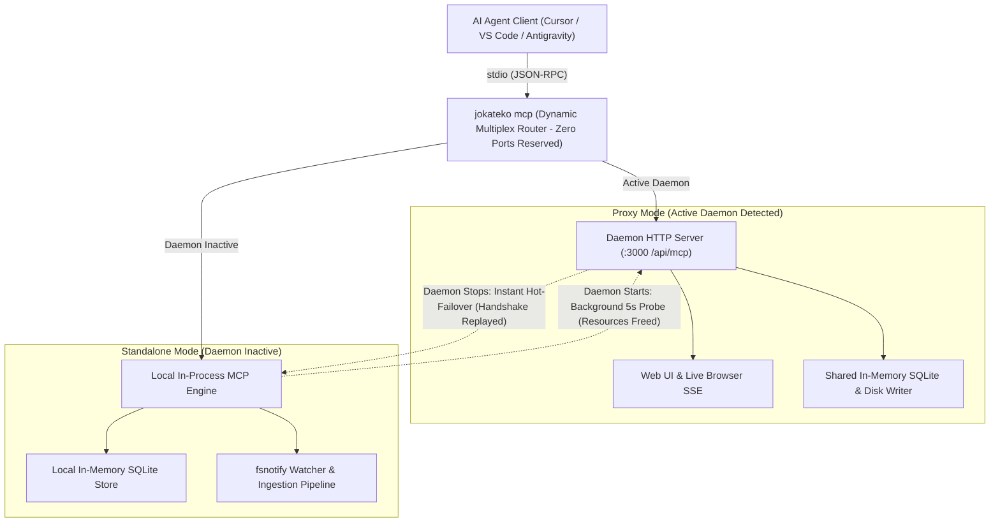

+++
title = 'Dynamic MCP Proxy Hot-Failover & Auto-Reconnect Engine'
status = 'done'
priority = 'high'
milestone = '260902-mvp'
tags = ['backend', 'feature']
summary = 'Implemented and verified dynamic MCP proxy hot-failover and auto-reconnect engine with multi-cycle integration testing.'
dependencies = ['260902-implement-strategy-and-glossary-mcp-muta']
+++

# Dynamic MCP Proxy Hot-Failover & Auto-Reconnect Engine

Enable Jokateko MCP server to operate without port reservations, seamlessly hot-failing over between remote HTTP proxy and local in-process standalone engine as daemons start and stop.

### How this Architecture Works

## Acceptance Criteria
- [x] Implement dynamic MCP transport router in `internal/proxy` keeping stdio JSON-RPC active while swapping backends
- [x] Implement immediate hot-failover to in-process standalone engine when active daemon disconnects
- [x] Implement background probe loop (5-second interval) in standalone mode to detect spawned daemon
- [x] Ensure local resources (in-memory SQLite, fsnotify watcher, ingestion pipeline) are completely closed and released upon transitioning to proxy mode
- [x] Add comprehensive test cycling daemon start and stop at least 3 times, verifying clean transitions and resource cleanup
- [x] Verify full test suite passes with `go test ./...` and run live validation

## Completion Summary
- **Completed At:** 2026-09-02T17:04:31Z

### What Was Done
Engineered dynamic MCP transport router with immediate hot-failover to in-process standalone engine, automatic background probe loop to reconnect to daemons, transparent handshake replay, and clean resource teardown (closing in-memory SQLite and fsnotify watcher). Verified through 3 full daemon start/stop cycles.

### Why / Rationale
Eliminates TCP port contention so AI agents and human users can coexist seamlessly, allowing containers and local servers to start/stop without disrupting the AI agent stdio session.
