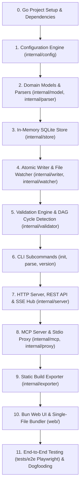

# Jokateko Implementation Plan & Feature Tree

> **Source of Truth & Documentation References:**
> - [`AGENTS.md`](file:///workspaces/jokateko/AGENTS.md)
> - [`COMMANDS.md`](file:///workspaces/jokateko/COMMANDS.md)
> - [`docs/README.md`](file:///workspaces/jokateko/docs/README.md)
> - [`docs/module-structure.md`](file:///workspaces/jokateko/docs/module-structure.md)
> - [`docs/file-structure.md`](file:///workspaces/jokateko/docs/file-structure.md)
> - [`docs/config-specification.md`](file:///workspaces/jokateko/docs/config-specification.md)
> - [`docs/mcp-specification.md`](file:///workspaces/jokateko/docs/mcp-specification.md)
> - [`docs/validation-and-linting.md`](file:///workspaces/jokateko/docs/validation-and-linting.md)
> - [`docs/web-ui-architecture.md`](file:///workspaces/jokateko/docs/web-ui-architecture.md)

---

## Overview & Implementation Strategy

Jokateko is built on a **Tasks-as-Code** and **Spec-First** methodology. Because Jokateko itself is the tool that will manage its own tasks once operational, this document (`PLAN.md`) acts as the external bootstrap tracker.

### Implementation Order Summary


---

## Phase 0: Project Initialization & Tooling Setup

- [x] **0.1 Initialize Go Module**
  - Target: `go.mod`
  - Module path: `github.com/RJuho/jokateko`
  - Go version: `1.27.0` (or `1.23+`)
  - Verification: `go env` shows module active.

- [x] **0.2 Declare Locked Backend Dependencies**
  - `github.com/pelletier/go-toml/v2` (TOML configuration)
  - `modernc.org/sqlite` (Pure Go in-memory SQLite, CGO-free)
  - `github.com/fsnotify/fsnotify` (Cross-platform file watcher)
  - `github.com/yuin/goldmark` (CommonMark parser & AST)
  - `github.com/modelcontextprotocol/go-sdk` (Official MCP Go SDK)
  - Verification: `go mod tidy` passes cleanly; zero CGO requirements.

- [x] **0.3 Scaffold Base Directory Structure**
  - Create directories:
    - `cmd/jokateko/`
    - `internal/config/`
    - `internal/model/`
    - `internal/parser/`
    - `internal/store/`
    - `internal/watcher/`
    - `internal/writer/`
    - `internal/validator/`
    - `internal/server/`
    - `internal/mcp/`
    - `internal/proxy/`
    - `internal/exporter/`
    - `internal/version/`
    - `web/dist/`
  - Create `internal/version/version.go`:
    - Variables: `Version = "dev"`, `Commit = "none"`, `Date = "unknown"` (injected via `-ldflags`)
    - Fallback: `runtime/debug.ReadBuildInfo()` when `Version == "dev"` to extract Git commit or module version
    - Helper `version.Get() Info` providing structured version data
  - Create stub `web/dist/index.html` with data injection placeholder comment:
    ```html
    <!DOCTYPE html><html><head><title>Jokateko</title></head><body><!-- DATA_INJECTION_POINT --><script id="jokateko-data" type="application/json">/* JOKATEKO_PAYLOAD_PLACEHOLDER */</script><div id="app">Jokateko UI Stub</div></body></html>
    ```
  - Create `web/embed.go` with `//go:embed dist/*` to allow early Go compilation.

- [x] **0.4 Create Root Makefile & Code Generation Setup**
  - Makefile variables:
    - `VERSION ?= $(shell git describe --tags --always --dirty 2>/dev/null || echo "dev")`
    - `COMMIT ?= $(shell git rev-parse --short HEAD 2>/dev/null || echo "none")`
    - `DATE ?= $(shell date -u +%Y-%m-%dT%H:%M:%SZ)`
    - `LDFLAGS := -X 'github.com/RJuho/jokateko/internal/version.Version=$(VERSION)' -X 'github.com/RJuho/jokateko/internal/version.Commit=$(COMMIT)' -X 'github.com/RJuho/jokateko/internal/version.Date=$(DATE)' -s -w`
  - Targets:
    - `make generate`: Run [`sqlc`](https://github.com/sqlc-dev/sqlc) to generate type-safe Go database models and query functions (`go run github.com/sqlc-dev/sqlc/cmd/sqlc@v1.27.0 generate`)
    - `make test`: Run all Go unit tests (`go test ./...`)
    - `make build`: Build Go binary with injected version flags (`go build -ldflags="$(LDFLAGS)" -o bin/jokateko ./cmd/jokateko`)
    - `make ui-build`: Bundle Web UI via Bun (`cd web && bun run build`)
    - `make lint`: Run Go vet and formatting checks


---

## Phase 1: Configuration Engine (`internal/config`)

- [x] **1.1 Define Configuration Structs & Versioning**
  - File: `internal/config/config.go`
  - Versioning: Top-level `version = "0"` to support future configuration migrations
  - Structs:
    - `Config`: Root configuration (`Version string` with tag `toml:"version"`)
    - `ProjectConfig`: `name`, `description`
    - `PathsConfig`: `tasks`, `milestones`, `strategies`, `glossary`, `export`
    - `ServerConfig`: `host`, `port`, `open_browser`, `security`
    - `ServerSecurityConfig`: `cors_enabled`, `cors_allowed_origins`, `csp`
    - `CSPConfig`: `enabled`, `default_src`, `script_src`, `style_src`, `img_src`, `connect_src`, `font_src`
    - `BoardConfig`: `columns` (`[]ColumnConfig{id, name, color}`)
    - `TagsConfig`: `allowed`, `enforce_allowed`
    - `MCPConfig`: `enabled`, `timeout_seconds`, `allow_mutations`

- [x] **1.2 Implement Default Configuration Generator**
  - File: `internal/config/defaults.go`
  - Function: `config.Default(baseDir string) *Config`
  - Defaults:
    - Version: `"0"`
    - Project name: base directory name
    - Paths: `.jokateko/tasks`, `.jokateko/milestones`, `.jokateko/strategies`, `.jokateko/glossary`, `dist-kanban`
    - Server: `127.0.0.1:8080`, CSP enabled, CORS disabled
    - Columns: `backlog` (#94a3b8), `ready` (#60a5fa), `in_progress` (#f59e0b), `in_review` (#a855f7), `done` (#10b981)
    - Tags: 11 standard tags (`backend`, `frontend`, `database`, `security`, `ui`, `auth`, `api`, `docs`, `testing`, `release`, `infra`), `enforce_allowed = true`
    - MCP: `enabled = true`, `allow_mutations = true`, `timeout_seconds = 30`

- [x] **1.3 Implement TOML File Loader & Environment Overrides**
  - File: `internal/config/load.go`
  - Function: `config.Load(rootPath string) (*Config, error)`
  - Environment variable overrides:
    - `JOKATEKO_CONFIG`: Custom path to `config.toml`
    - `JOKATEKO_HOST`: Bind address override
    - `JOKATEKO_PORT`: Port number override
  - Graceful fallback: If `.jokateko/config.toml` is absent, returns built-in defaults (version `"0"`) without error.

- [x] **1.4 Implement Configuration Invariant Validation**
  - File: `internal/config/validate.go`
  - Validation rules:
    - `CFG-000`: `config-version`: Configuration `version` must match a supported version string (initially `"0"`).
    - `CFG-001`: TOML syntax validity
    - `CFG-002`: Column count >= 2
    - `CFG-003`: Column IDs non-empty and unique
    - `CFG-004`: Port range 1024-65535
    - `CFG-005`: Paths do not escape root directory (path traversal check)
    - `TAG-001`: Tag names follow kebab-case (`^[a-z0-9]+(-[a-z0-9]+)*$`)
    - `TAG-002`: Tag names are unique
  - Hex color validation (`#rgb` or `#rrggbb`)

- [x] **1.5 Unit Tests for Configuration Engine**
  - File: `internal/config/config_test.go`
  - Test cases: default generation (verifying `version == "0"`), valid TOML parsing, unsupported version rejection, missing file fallback, environment overrides, invalid port, duplicate columns, path traversal attempts, and tag format validation.

---

## Phase 2: Domain Models & Parsing (`internal/model`, `internal/parser`)

- [x] **2.1 Define Domain Models**
  - Files:
    - `internal/model/task.go`: `Task`, `TaskFrontmatter`, `Priority` enum (`low`, `medium`, `high`, `critical`)
    - `internal/model/milestone.go`: `Milestone`, `MilestoneFrontmatter`
    - `internal/model/strategy.go`: `Strategy`, `StrategyFrontmatter`, `Tier` (1, 2, 3)
    - `internal/model/glossary.go`: `GlossaryTerm`, `GlossaryFrontmatter`
    - `internal/model/board.go`: `BoardState`, `ColumnState`, `FilterCriteria`
    - `internal/model/tag.go`: `TagCount`

- [x] **2.2 Frontmatter Parser & Delimiter Splitter (TOML)**
  - File: `internal/parser/frontmatter.go`
  - Responsibilities:
    - Split markdown file on required `+++` frontmatter delimiter (strict Hugo standard)
    - Parse TOML frontmatter using `github.com/pelletier/go-toml/v2` into target domain models (`TaskFrontmatter`, `MilestoneFrontmatter`, `StrategyFrontmatter`, `GlossaryFrontmatter`)
    - Extract body text and line numbers for precise diagnostic errors
    - Validate required fields (`title`, `summary`, etc.)

- [x] **2.3 Markdown Parser & Acceptance Criteria Extractor (Goldmark)**
  - File: `internal/parser/markdown.go`
  - Responsibilities:
    - Use `github.com/yuin/goldmark` to parse markdown AST
    - Extract `- [ ]` and `- [x]` checkboxes to calculate task acceptance criteria progress
    - Extract headings, descriptions, and code blocks
    - Render HTML where necessary for static exports

- [x] **2.4 Checkbox Item Management & Completion Summary Formatter**
  - File: `internal/parser/complete.go`
  - Responsibilities:
    - `UpdateCheckboxByIndex(body string, targetIndex int, completed bool) (string, error)`: Toggles the 1-based `targetIndex`-th checkbox in markdown body between `- [ ]` and `- [x]`
    - `VerifyAllCheckboxesCompleted(body string) error`: Rejects completion if any open `- [ ]` checkboxes remain, detailing remaining count and guiding AI to `list_task_items` / `update_task_item`
    - Format and append `## Completion Summary` section (`Completed At`, `### What Was Done`, `### Why / Rationale`)

- [x] **2.5 Unit Tests for Parsing Engine**
  - File: `internal/parser/parser_test.go` and `internal/parser/markdown_test.go`
  - Test cases: valid task markdown with TOML frontmatter (`+++`), missing frontmatter delimiters, malformed TOML, acceptance criteria extraction, 1-based checkbox toggling, open checkbox rejection guard, completion summary injection.

---

## Phase 3: Storage & In-Memory Index (`internal/store`)

- [x] **3.1 SQLite DDL Schema & sqlc Code Generation Setup**
  - References: [`sqlc` (https://github.com/sqlc-dev/sqlc)](https://github.com/sqlc-dev/sqlc)
  - Files:
    - `internal/store/schema.sql`: Table definitions and DDL migrations
    - `internal/store/queries.sql`: SQL queries annotated for `sqlc`
    - `internal/store/sqlc.yaml`: Configuration for [`sqlc`](https://github.com/sqlc-dev/sqlc) targeting the `sqlite` engine to generate pure Go code (`models.go` and `queries.sql.go`)
  - Tables:
    - `tasks` (id, title, status, priority, milestone_id, summary, body, filepath, mtime)
    - `milestones` (id, title, status, target_date, summary, body, filepath, mtime)
    - `strategies` (id, title, tier, summary, body, filepath, mtime)
    - `glossary` (id, title, summary, body, filepath, mtime)
    - `task_dependencies` (task_id, depends_on_task_id)
    - `entity_tags` (entity_type, entity_id, tag)
    - FTS5 virtual tables for full-text search across all entities

- [x] **3.2 In-Memory Store Initialization with sqlc & modernc.org/sqlite**
  - File: `internal/store/store.go`
  - Implementation:
    - Open pure Go SQLite in-memory database (`file::memory:?cache=shared`) using `modernc.org/sqlite` (no CGO)
    - Execute embedded `schema.sql` on startup to prepare tables and indexes
    - Wrap the [`sqlc`](https://github.com/sqlc-dev/sqlc)-generated `Queries` interface within the `Store` struct
    - Concurrency protection via `sync.RWMutex` across all goroutines
    - Helper transactions for atomic upserts and deletes

- [x] **3.3 Entity CRUD & Query Operations**
  - Files:
    - `internal/store/tasks.go`: Insert/Update/Delete task, List tasks with filters (status, milestone, tag, priority), Get task by ID
    - `internal/store/milestones.go`: Insert/Update/Delete milestone, List milestones with computed task completion metrics
    - `internal/store/strategies.go`: Insert/Update/Delete strategy, List strategies by tier/tag, Get strategy by ID
    - `internal/store/glossary.go`: Insert/Update/Delete glossary term, List/Search terms
    - `internal/store/tags.go`: List allowed tags with usage count aggregation across tasks, milestones, strategies
    - `internal/store/board.go`: Aggregate board state (columns and task counts)

- [x] **3.4 Full-Text Search Queries**
  - File: `internal/store/search.go`
  - Operations:
    - `SearchTasks(query, tag, limit)`
    - `SearchMilestones(query, tag, limit)`
    - `SearchStrategies(query, tag, limit)`
    - `SearchGlossary(query, tag, limit)`
    - `SearchAll(query, tag, limit)`: Universal multi-entity search returning snippet and score

- [x] **3.5 Dependency & Unblocking Queries**
  - File: `internal/store/dependencies.go`
  - Queries:
    - Check if all dependencies for a task are in `done` status
    - Find downstream unblocked tasks when a specific task transitions to `done`

- [x] **3.6 Unit Tests for In-Memory Store**
  - File: `internal/store/store_test.go`, `internal/store/search_test.go`, and `internal/store/dependencies_test.go`
  - Test cases: concurrent reads/writes, transaction rollback, entity upserts, tag aggregation, milestone progress calculation, full-text search snippet matching, downstream unblock resolution.

---

## Phase 4: Atomic Writer & Filesystem Watcher (`internal/writer`, `internal/watcher`)

- [x] **4.1 Safe Atomic File Persistence**
  - File: `internal/writer/writer.go`
  - Implementation:
    - Write to temporary file in destination folder (`.filename.tmp`)
    - Execute `fsync` on temporary file descriptor
    - Atomically rename temporary file over target file (`os.Rename`)
    - Provide deletion helper (`os.Remove`)

- [x] **4.2 Watcher Suppression Cache (Echo Prevention)**
  - File: `internal/writer/suppress.go`
  - Implementation:
    - In-memory thread-safe LRU/cache of recent writer touches (filepath + hash + timestamp)
    - Prevents `fsnotify` event loopback when Jokateko writes files itself

- [x] **4.3 Filesystem Watcher & Debounce Loop**
  - File: `internal/watcher/watcher.go`
  - Implementation:
    - Initialize `fsnotify.NewWatcher()`
    - Add watches on: `.jokateko/tasks/`, `.jokateko/milestones/`, `.jokateko/strategies/`, `.jokateko/glossary/`, and `config.toml`
    - Filter temporary editor files (`.swp`, `~`, `.DS_Store`, `.tmp`)
    - Debounce timer (50ms) to coalesce rapid write flushes
    - Emit typed change events (`Create`, `Update`, `Delete`) to ingestion handler

- [x] **4.4 Watcher Ingestion Pipeline**
  - File: `internal/watcher/ingest.go`
  - Implementation:
    - On file event: read file, parse frontmatter & body, update in-memory store
    - If `config.toml` changed: reload config and trigger board reload
    - On delete event: remove entity from in-memory store
    - Broadcast entity change event to SSE channel

- [x] **4.5 Unit Tests for Writer & Watcher**
  - Files: `internal/writer/writer_test.go`, `internal/watcher/watcher_test.go`
  - Test cases: atomic write integrity, watcher debounce coalescing, suppression cache hit/miss, corrupted file handling.

---

## Phase 5: Validation Engine & DAG Cycle Detection (`internal/validator`)

- [x] **5.1 Frontmatter Schema Rules Validator**
  - File: `internal/validator/rules.go`
  - Implement rules:
    - Task rules: `TSK-001` (filename format), `TSK-002` (frontmatter valid), `TSK-003` (required fields), `TSK-004` (valid status), `TSK-005` (valid priority), `TSK-006` (milestone exists), `TSK-007` (dependencies exist), `TSK-008` (no self dependency), `TSK-009` (allowed tags)
    - Milestone rules: `MLS-001` (filename), `MLS-002` (frontmatter), `MLS-003` (required fields), `MLS-004` (date format), `MLS-005` (allowed tags)
    - Strategy rules: `STR-001` (frontmatter), `STR-002` (required fields), `STR-003` (valid tier 1-3), `STR-004` (allowed tags)
    - Glossary rules: `GLS-001` (frontmatter), `GLS-002` (required fields), `GLS-003` (unique term title), `GLS-004` (allowed tags)

- [x] **5.2 Dependency Graph DAG & Cycle Detection (`DAG-001`)**
  - File: `internal/validator/cycle.go`
  - Implementation:
    - Construct directed graph of task dependencies ($A \to B$)
    - Execute 3-color Depth First Search (White = unvisited, Gray = visiting, Black = visited)
    - If a Gray node is encountered, extract exact cycle path (e.g., `A -> B -> C -> A`)
    - Produce detailed diagnostic error `DAG-001`

- [x] **5.3 Diagnostic Formatter & Engine Orchestrator**
  - File: `internal/validator/validator.go`
  - Implementation:
    - Scan all project files
    - Collect errors and warnings with file path, line numbers, and actionable remediation text
    - Format output matching compiler-style diagnostics (colored output if terminal)
    - Return exit status (Code `0` on success, Code `1` on error)

- [x] **5.4 Unit Tests for Validation Engine**
  - File: `internal/validator/validator_test.go`
  - Test cases: valid project state, cyclic dependencies (2-node and multi-node cycles), missing dependencies, invalid status columns, unauthorized tags, dangling milestone references.

---

## Phase 6: CLI Implementation (`cmd/jokateko/`)

- [x] **6.1 Root CLI Dispatcher & Flag Handling**
  - File: `cmd/jokateko/main.go`
  - Subcommands: `serve` (or default empty), `parse` (alias `lint`), `build`, `init`, `mcp`, `version`, `help`
  - Signal handling for graceful shutdown (`SIGINT`, `SIGTERM`)
  - Zero external CLI libraries (pure `flag.FlagSet`)

- [x] **6.2 `version` Subcommand**
  - File: `cmd/jokateko/version.go`
  - Uses `internal/version.Get()`
  - Output: formatted version string (`jokateko v1.1.1 (commit: abc1234, built: 2026-09-01T12:00:00Z, linux/amd64)`) or optional `--json` flag output

- [x] **6.3 `init` Scaffolding Subcommand**
  - File: `cmd/jokateko/init.go`
  - Create directory layout: `.jokateko/tasks/`, `.jokateko/milestones/`, `.jokateko/strategies/`, `.jokateko/glossary/`
  - Write default `.jokateko/config.toml` with `version = "0"` and standard columns/tags
  - Write starter `AGENTS.md` and initial sample strategy / glossary entry
  - Ensure zero overwriting of existing configuration

- [x] **6.4 `parse` / `lint` Subcommand**
  - File: `cmd/jokateko/parse.go`
  - Executes `internal/validator` in dry-run mode
  - Exits with `0` on clean state or `1` with diagnostics

- [x] **6.5 Integration Tests for CLI Commands**
  - File: `cmd/jokateko/main_test.go`
  - Test cases: `init` in empty directory, `parse` on newly initialized project, `version` output, invalid flag handling.

---

## Phase 7: HTTP Server, REST API & SSE Hub (`internal/server`)

- [x] **7.0 Pure Go TypeScript Type Generator (`cmd/gentypes`)**
  - File: `cmd/gentypes/main.go`
  - Implementation:
    - Pure Go AST generator parsing `internal/model` structs and enums
    - Emits TypeScript type definitions to `web/src/types/generated.ts`
    - Integrated into `make generate` (zero external npm or protobuf dependencies)
    - Generates: `Task`, `TaskFrontmatter`, `Priority`, `Milestone`, `MilestoneStatus`, `Strategy`, `Tier`, `GlossaryTerm`, `TagCount`, `BoardState`, `ColumnState`, `Column`, `FilterCriteria`, `SearchResult`, `SSEEvent`

- [x] **7.1 Server Configuration & Security Headers Middleware**
  - File: `internal/server/server.go`
  - Middleware:
    - Content-Security-Policy (CSP) injection based on `config.toml`
    - CORS headers if enabled
    - Request logging and panic recovery
  - Embedded static file handler serving `web/embed.go` at `/`

- [x] **7.2 Server-Sent Events (SSE) Hub**
  - File: `internal/server/sse.go`
  - Implementation:
    - Client subscriber registry with thread-safe subscribe/unsubscribe
    - Granular event broadcaster (`task.created`, `task.updated`, `task.deleted`, `board.refreshed`)
    - Keepalive heartbeat ping (every 15-30s)
    - Endpoint: `GET /api/events`

- [x] **7.3 Health Check & Version Endpoints**
  - File: `internal/server/handlers_health.go`
  - Endpoints: `GET /api/health`, `GET /api/version`
  - Returns: JSON status, uptime, project name, version info from `internal/version.Get()`
  - Used by `jokateko mcp` CLI proxy to detect running daemon

- [x] **7.4 Board & Entity REST Endpoints**
  - Files:
    - `internal/server/handlers_board.go`: `GET /api/board`
    - `internal/server/handlers_tasks.go`: `GET /api/tasks`, `GET /api/tasks/{id}`, `POST /api/tasks`, `PUT /api/tasks/{id}`, `DELETE /api/tasks/{id}`
    - `internal/server/handlers_milestones.go`: `GET /api/milestones`, `GET /api/milestones/{id}`, `POST /api/milestones`, `PUT /api/milestones/{id}`, `DELETE /api/milestones/{id}`
    - `internal/server/handlers_strategies.go`: `GET /api/strategies`, `GET /api/strategies/{id}`, `POST /api/strategies`, `PUT /api/strategies/{id}`, `DELETE /api/strategies/{id}`
    - `internal/server/handlers_glossary.go`: `GET /api/glossary`, `GET /api/glossary/{id}`, `POST /api/glossary`, `PUT /api/glossary/{id}`, `DELETE /api/glossary/{id}`
    - `internal/server/handlers_tags.go`: `GET /api/tags`
    - `internal/server/handlers_search.go`: `GET /api/search`
  - Mutations route through `internal/writer` for atomic disk writes and trigger SSE broadcasts

- [x] **7.5 `serve` Subcommand Wiring**
  - File: `cmd/jokateko/serve.go`
  - Lifecycle:
    1. Load config
    2. Initialize in-memory store
    3. Ingest existing files via `watcher.Pipeline.ProcessAll`
    4. Start `fsnotify` file watcher and ingestion loop
    5. Start HTTP server & SSE hub
    6. Wait for interrupt signal (`SIGINT`, `SIGTERM`) -> graceful shutdown

- [x] **7.6 Integration Tests for HTTP Server & REST API**
  - File: `internal/server/server_test.go`
  - Test cases: health check response, board state retrieval, task creation via REST, task update via REST, SSE event receipt, CSP header presence, search endpoint.

---

## Phase 8: Model Context Protocol (MCP) Server & Proxy (`internal/mcp`, `internal/proxy`)

- [x] **8.1 Initialize Official MCP Go SDK Server**
  - File: `internal/mcp/mcp.go`
  - Integration with `github.com/modelcontextprotocol/go-sdk`
  - Register server capabilities: tools, resources, prompts

- [x] **8.2 Implement MCP Task Tools**
  - File: `internal/mcp/tools_task.go`
  - Tools:
    - `list_tasks`: Compact summary list with filters (`status`, `milestone`, `tag`, `priority`)
    - `get_task`: Full specification, markdown body, acceptance criteria
    - `list_task_items`: Lists all checklist items from markdown with 1-based `index`, `completed` state, and `text`
    - `update_task_item`: Toggles a checklist item at 1-based `index` as done or undone (`completed: bool`)
    - `create_task`: Controlled tag validation + Closed Milestone Guard + atomic file creation
    - `update_task_status`: Column transition; **Strict 'Done' Guard** rejecting transitions to `done` directly
    - `complete_task`: Enforces dependencies are done + **Strict Open Checkbox Guard** (strictly rejects if uncompleted checkboxes exist, guiding AI to use `list_task_items` and `update_task_item`) + appends `## Completion Summary` (`what_done`, `why_done`) + marks `done` + returns unblocked tasks
    - `update_task_content`: Edits title, summary, priority, milestone, tags, body

- [x] **8.3 Implement MCP Milestone Tools**
  - File: `internal/mcp/tools_milestone.go`
  - Tools:
    - `list_milestones`: Auto-archive calculation (hidden if 100% complete unless `include_archived=true`)
    - `get_milestone`: Full milestone detail and assigned task list
    - `create_milestone`: Creates `YYMMDD-<slug>.md`
    - `update_milestone`: Updates target date, status, summary, body

- [x] **8.4 Implement MCP Strategy & Glossary Tools**
  - Files:
    - `internal/mcp/tools_strategy.go`: `list_strategies` (Progressive Disclosure summary & tier discovery), `get_strategy` (full document)
    - `internal/mcp/tools_glossary.go`: `lookup_glossary` (term lookup or full dictionary)

- [x] **8.5 Implement MCP Search & Tag Tools**
  - Files:
    - `internal/mcp/tools_search.go`: `search_tasks`, `search_milestones`, `search_strategies`, `search_glossary`, `search_all`
    - `internal/mcp/tools_tag.go`: `list_tags` (controlled tag vocabulary with usage counts)
    - `internal/mcp/tools_board.go`: `get_board_state` (column summary and counts)

- [ ] **8.6 Implement MCP Resources & Prompts**
  - Files:
    - `internal/mcp/resources.go`: `jokateko://board`, `jokateko://strategies/tier1`, `jokateko://glossary`
    - `internal/mcp/prompts.go`: `next_task` prompt template recommending ready task with unblocked dependencies and relevant Tier-1 strategies

- [ ] **8.7 Implement Stdio-to-HTTP Proxy & Standalone Runner**
  - File: `internal/proxy/proxy.go`
  - Logic:
    1. Probe `GET http://127.0.0.1:<port>/api/health`
    2. If active: Bridge stdio JSON-RPC messages to running daemon's MCP endpoint
    3. If inactive: Initialize internal in-memory store, watcher, and run MCP server over stdio in-process

- [ ] **8.8 `mcp` Subcommand Implementation**
  - File: `cmd/jokateko/mcp.go`
  - Runs the proxy / standalone handler

- [ ] **8.9 Unit & Integration Tests for MCP Server**
  - Files: `internal/mcp/mcp_test.go`, `internal/proxy/proxy_test.go`
  - Test cases: tool execution, strict done guard rejection, complete task unblocking, search execution, resource reads, prompt generation, proxy mode fallback.

---

## Phase 9: Static Build Exporter (`internal/exporter`)

- [ ] **9.1 Snapshot Serializer**
  - File: `internal/exporter/snapshot.go`
  - Gathers all entities from in-memory store and serializes into minified JSON matching `SnapshotSchema`

- [ ] **9.2 HTML Snapshot Injector**
  - File: `internal/exporter/exporter.go`
  - Reads embedded `web/dist/index.html`
  - Replaces `/* JOKATEKO_PAYLOAD_PLACEHOLDER */` with serialized JSON snapshot
  - Writes single self-contained output file (`dist-kanban/index.html` or custom flag path)

- [ ] **9.3 `build` Subcommand Implementation**
  - File: `cmd/jokateko/build.go`
  - Flags: `--out` (default from `config.toml` `paths.export`)
  - Ingests project, builds snapshot, writes HTML export, prints file size and status

- [ ] **9.4 Unit Tests for Exporter**
  - File: `internal/exporter/exporter_test.go`
  - Test cases: valid HTML replacement, special character escaping in JSON, export file generation.

---

## Phase 10: Bun Web UI (`web/`)

- [ ] **10.1 Frontend Project Initialization**
  - Path: `web/package.json`
  - Dependencies:
    - `preact`: `^10.26.0`
    - `valibot`: `^1.1.0`
  - Dev dependencies:
    - Tailwind CSS Standalone CLI
    - Bun 1.4+ native bundler
  - TypeScript config: `web/tsconfig.json`

- [ ] **10.2 Valibot Runtime Schemas & Type Contracts**
  - File: `web/src/schemas/models.ts`
  - Schemas:
    - `TaskSchema`
    - `MilestoneSchema`
    - `StrategySchema`
    - `GlossaryTermSchema`
    - `ColumnSchema`
    - `SnapshotSchema`
  - Infer TypeScript types from schemas: `Task`, `Milestone`, `Strategy`, `GlossaryTerm`, `Column`, `Snapshot`

- [ ] **10.3 Single-Bundle Snapshot Loader & Error Boundary**
  - File: `web/src/state/bootstrap.ts`
  - Implementation:
    - Check `<script id="jokateko-data">`
    - If payload exists: run `v.safeParse(SnapshotSchema, data)`
    - If valid: activate **Static Mode**
    - If empty: activate **Live Mode** (fetch `/api/board`)
    - If malformed: display non-fatal diagnostic warning banner with schema issues and render available data

- [ ] **10.4 State Management & SSE Real-Time Listener**
  - Files:
    - `web/src/state/store.ts`: Preact signals store (`mode`, `activeTab`, `tasks`, `milestones`, `strategies`, `glossary`, `filters`, `activeModal`)
    - `web/src/state/sse.ts`: `EventSource` listener for live updates (`task.created`, `task.updated`, `task.deleted`, `board.refreshed`) with automatic reconnect

- [ ] **10.5 Core UI Layout Components**
  - Files:
    - `web/src/components/common/Header.tsx`: Project title, mode indicator badge (`data-testid="mode-indicator-live"`, `data-testid="mode-indicator-static"`), tab navigation (`data-testid="tab-board"`, `data-testid="tab-milestones"`, `data-testid="tab-strategies"`, `data-testid="tab-glossary"`)
    - `web/src/components/common/FilterBar.tsx`: Real-time text search (`data-testid="search-input"`), tag multi-select, milestone filter, priority dropdown
    - `web/src/components/common/Badge.tsx`: Reusable priority and tag badges
    - `web/src/components/common/ValidationBanner.tsx`: Warning banner for schema issues (`data-testid="validation-error-banner"`)

- [ ] **10.6 Kanban Board Components**
  - Files:
    - `web/src/components/board/KanbanBoard.tsx`: Columns container
    - `web/src/components/board/Column.tsx`: Individual column (`data-testid="column-<column-id>"`) with task count and color bar
    - `web/src/components/board/TaskCard.tsx`: Card item (`data-testid="task-card-<task-id>"`) with drag-and-drop support (disabled in static mode), title, summary, priority, and tags

- [ ] **10.7 Detail & Edit Modals**
  - Files:
    - `web/src/components/modal/TaskDetailModal.tsx`: Task preview (`data-testid="task-detail-modal"`), markdown body renderer, acceptance criteria checkboxes, completion summary
    - `web/src/components/modal/TaskEditModal.tsx`: Card editing form (disabled/hidden in static export mode)

- [ ] **10.8 Milestones, Strategies & Glossary Views**
  - Files:
    - `web/src/components/milestones/MilestonesView.tsx`: Milestone cards with progress bar and completed task counter
    - `web/src/components/strategies/StrategiesView.tsx`: Progressive disclosure view (Tier 1/2/3 filter, expandable markdown specs)
    - `web/src/components/glossary/GlossaryView.tsx`: Alphabetical glossary terminology index

- [ ] **10.9 Bun Native Single-File Bundler Script**
  - File: `web/scripts/bundle.ts`
  - Build pipeline:
    1. Run Tailwind CLI to generate minified CSS
    2. Invoke `Bun.build({ entrypoints: ['src/index.tsx'], minify: true })`
    3. Inline compiled CSS into `<style>` tag
    4. Inline compiled JS bundle into `<script>` tag
    5. Output self-contained `web/dist/index.html` with data injection placeholder
  - Script command in `package.json`: `"build": "bun run scripts/bundle.ts"`

---

## Phase 11: End-to-End Validation & Automated Testing

- [ ] **11.1 Playwright E2E Test Suite Setup**
  - Directory: `tests/e2e/`
  - Runner: `bunx playwright test`
  - Browser: Chromium headless

- [ ] **11.2 E2E Test Scenarios**
  - `tests/e2e/board.spec.ts`:
    - Launch `jokateko serve`
    - Verify board renders with all columns from `config.toml`
    - Verify cards render in matching columns (`data-testid="task-card-<id>"`)
    - Test real-time filter bar text search and tag filtering
  - `tests/e2e/task-mutation.spec.ts`:
    - Drag card to another column or edit via modal
    - Verify task file on disk updates atomically
    - Verify SSE event broadcasts and updates browser state
  - `tests/e2e/static-export.spec.ts`:
    - Run `jokateko build`
    - Open exported `index.html` via `file:///`
    - Verify static mode indicator badge is present
    - Verify board renders completely without network requests
    - Verify editing controls are disabled/hidden
    - Verify search and modal viewers work offline
  - `tests/e2e/valibot-resilience.spec.ts`:
    - Inject slightly malformed JSON snapshot
    - Verify `data-testid="validation-error-banner"` displays warnings gracefully without crashing board

- [ ] **11.3 Project Dogfooding**
  - Run `jokateko init` on a clean repository
  - Run `jokateko parse` to verify 0 errors
  - Connect AI agent via MCP (`jokateko mcp`)
  - Create and complete tasks using MCP tools
  - Export standalone snapshot with `jokateko build`

- [ ] **11.4 GitHub Actions CI/CD Release Workflow**
  - File: `.github/workflows/release.yml`
  - Trigger: Push of Git tags matching `v*.*.*` (e.g. `v1.1.1`)
  - Steps:
    1. Set up Bun 1.4 & build frontend (`bun run build` producing `web/dist/index.html`)
    2. Set up Go 1.27 (`CGO_ENABLED=0`)
    3. Matrix cross-compilation:
       - `linux/amd64`, `linux/arm64`
       - `darwin/amd64`, `darwin/arm64`
       - `windows/amd64`
    4. Inject version variables via `-ldflags`:
       `-X 'github.com/RJuho/jokateko/internal/version.Version=${{ github.ref_name }}' -X 'github.com/RJuho/jokateko/internal/version.Commit=${{ github.sha }}' -X 'github.com/RJuho/jokateko/internal/version.Date=$(date -u +%Y-%m-%dT%H:%M:%SZ)' -s -w`
    5. Generate SHA256 checksums (`checksums.txt`)
    6. Publish binary artifacts and release notes to GitHub Releases via `softprops/action-gh-release`

