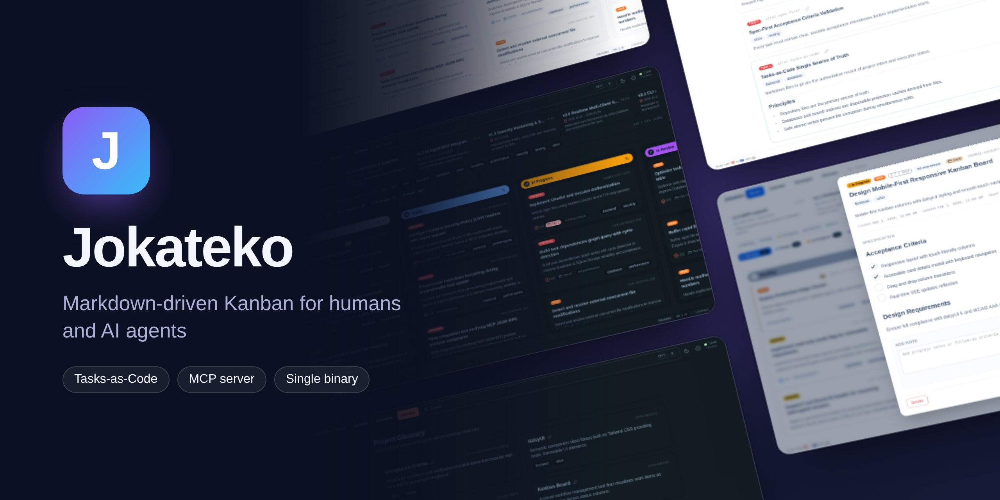

# Jokateko



A local, Markdown-driven Kanban board for developers and their AI agents.

Tasks, milestones, architecture strategies and glossary terms are plain Markdown files in your repository's `.jokateko/` folder. They are versioned, reviewed and merged like code. Jokateko indexes them, serves a live board in your browser, and gives AI agents the same data through a built-in MCP server.

## Features

- **Live board and calendar.** Drag cards between columns, filter, search, and plan by due date. Edits are written straight back to the Markdown files.
- **Strategies and glossary.** Tiered architecture rules and shared terminology, so humans and agents load only the context they need.
- **Built-in MCP server.** `jokateko mcp` gives agents safe, validated tools. It shares one board with a running `serve`, or works on its own.
- **Static export.** `jokateko build` writes the whole board to one self-contained HTML file.
- **CI linting.** `jokateko parse` validates frontmatter, references and dependency cycles.
- **One binary.** Pure Go with zero CGO, no runtime dependencies, for Linux, macOS and Windows.

## Install

**Install script (Linux, macOS).**

```sh
curl -fsSL https://jokateko.dev/install.sh | sh
```

The script downloads the latest release binary for your OS and architecture from GitHub Releases, checks its SHA-256 against the release's `checksums.txt`, and installs it to `~/.local/bin` without sudo. Set `JOKATEKO_VERSION=v0.1.0` to pin a version, or `JOKATEKO_INSTALL_DIR` to install somewhere else. To read the script before running it:

```sh
curl -fsSLO https://jokateko.dev/install.sh
less install.sh
sh install.sh
```

To uninstall, delete the binary: `rm ~/.local/bin/jokateko`.

**Release binary (any platform, including Windows).** Download your platform's binary (`linux`/`darwin` × `amd64`/`arm64`, or `windows-amd64.exe`) from [Releases](https://github.com/RJuho/jokateko/releases) and verify it:

```sh
curl -LO https://github.com/RJuho/jokateko/releases/latest/download/jokateko-linux-amd64
curl -LO https://github.com/RJuho/jokateko/releases/latest/download/checksums.txt
sha256sum --ignore-missing -c checksums.txt
chmod +x jokateko-linux-amd64 && mv jokateko-linux-amd64 ~/.local/bin/jokateko
```

**Docker.**

```sh
docker run --rm -p 8080:8080 -e JOKATEKO_HOST=0.0.0.0 -v "$PWD:/workspace" ghcr.io/rjuho/jokateko
```

**From source.** This needs Go 1.27+ and [Bun](https://bun.sh). `make build` puts the binary in `bin/jokateko`, and `make install` copies it to `~/.local/bin`. (`go install` does not work, because the embedded web UI is generated at build time.)

## Quickstart

```sh
cd my-project
jokateko init      # creates .jokateko/ with a config and starter files
jokateko serve     # http://127.0.0.1:8080
```

Open the board and add a task with **+** in the Backlog column. Commit `.jokateko/` together with your code.

## Connect an AI agent

Add Jokateko to your agent's MCP config, for example `.mcp.json`:

```json
{
  "mcpServers": {
    "Jokateko": { "command": "jokateko", "args": ["mcp"] }
  }
}
```

If `jokateko serve` is running for the same folder, `jokateko mcp` proxies to it, so agent changes appear live on the board. Otherwise it runs standalone. It switches between the two automatically. Agents receive the workflow rules in the MCP handshake. Have them change `.jokateko/` only through the MCP tools, never by editing files directly.

## CLI

| Command | Does | Key flags |
|---|---|---|
| `serve` (default) | Web UI, REST API and MCP daemon | `-dir` `-port` |
| `mcp` | MCP over stdio; proxies to a running `serve` | `-dir` `-port` |
| `init` | Scaffold `.jokateko/` | `-name` `-replace` |
| `parse` / `lint` | Validate everything; exit 1 on errors | `-dir` |
| `build` | Single-file HTML export | `-out` `-mermaidjs=cdn\|bundled\|none` |
| `version` · `about` · `licenses` · `help` | Info | |

Run `jokateko <command> -h` for all flags.

## Configuration

`.jokateko/config.toml` overlays the built-in defaults. Set only what you want to change, such as columns, priorities, tags, port, locale or UI labels. All options are listed in [`internal/config/default.toml`](internal/config/default.toml). The environment variables `JOKATEKO_HOST`, `JOKATEKO_PORT` and `JOKATEKO_CONFIG` override the file. The config is read at startup.

## Security

Jokateko binds to `127.0.0.1` by default and has **no authentication**. Do not expose it to a network. See [SECURITY.md](SECURITY.md).

## This repository uses Jokateko

Jokateko's own board, architecture strategies and glossary live in [`.jokateko/`](.jokateko/). Run `jokateko serve` in a clone or `jokateko build` to browse them, and start with the [architecture strategy](.jokateko/strategies/architecture.md).

## Contributing and license

See [CONTRIBUTING.md](CONTRIBUTING.md) and [SECURITY.md](SECURITY.md). Jokateko is released under the [MIT License](LICENSE).
