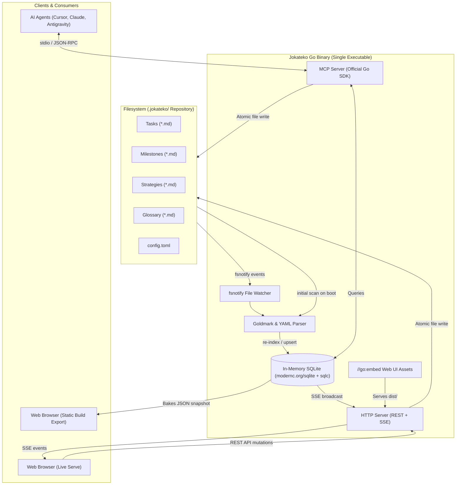

# Jokateko Architecture & Specifications

Welcome to the technical design and architectural documentation for **Jokateko**, a local, Markdown-driven Kanban and task management tool engineered for human developers and AI agents.

Jokateko operates on a strict **"Tasks-as-Code"** and **"Spec-First"** philosophy where repository markdown files are the absolute source of truth.

---

## 1. System Philosophy & Core Principles

1. **Tasks-as-Code & Spec-First:**
   - Every task, milestone, strategy, and glossary entry is stored as plain Markdown with YAML frontmatter.
   - Version-controlled alongside project code in Git.
   - Zero external databases required; all files are human-readable, git-diffable, and mergeable.

2. **Zero Runtime Dependencies & Single Executable:**
   - Pure Go backend with zero CGO dependencies (utilizing `modernc.org/sqlite`).
   - Pure Go TOML configuration (`github.com/pelletier/go-toml/v2`).
   - Web UI is compiled with Bun into static assets and embedded into the Go executable via `//go:embed`.
   - Cross-compiles deterministically to a single static binary for Linux, macOS, and Windows.

3. **Unidirectional State Synchronization:**
   - Filesystem is the sole source of truth.
   - An in-memory SQLite database acts as a query cache and search index, rebuilt on launch and kept live via `fsnotify`.
   - File updates trigger in-memory SQLite upserts, which broadcast real-time Server-Sent Events (SSE) to connected Web UI clients.

4. **First-Class AI Agent Support (MCP):**
   - Built-in Model Context Protocol (MCP) server using the official Go SDK (`modelcontextprotocol/go-sdk`).
   - Provides structured reading and safe mutation tools.
   - Dual-mode MCP: serves over stdio, seamlessly proxying to the running `serve` daemon if active, or running standalone.
   - Progressive disclosure for architectural strategies so agents load context on-demand without exhausting token limits.

5. **Dual Web UI Operating Modes (Single Bundle):**
   - **`serve` (Interactive Live Mode):** Full real-time Kanban board connecting to the local Go backend via REST and SSE.
   - **`build` (Interactive Static Export):** A standalone HTML/CSS/JS export containing the entire project snapshot baked into `index.html`. Preact activates an offline read-only mode where board viewing, search, filtering, and modal specs function without any server.

---

## 2. Specification Index

The detailed plans are organized into focused specifications:

- **[Module Structure](file:///workspaces/jokoteko/docs/module-structure.md):** Go packages, domain boundaries, data flow, and interfaces.
- **[File Structure](file:///workspaces/jokoteko/docs/file-structure.md):** Source repository layout and target project `.jokateko/` workspace layout.
- **[Configuration Specification](file:///workspaces/jokoteko/docs/config-specification.md):** TOML schema, default configuration, environment overrides, and path resolution.
- **[MCP Specification](file:///workspaces/jokoteko/docs/mcp-specification.md):** MCP tools, resources, prompts, stdio daemon proxy, and JSON schemas.
- **[Web UI Architecture](file:///workspaces/jokoteko/docs/web-ui-architecture.md):** Preact SPA, single-bundle snapshot injection, SSE synchronization, and Playwright testing.
- **[Validation & Linting Engine](file:///workspaces/jokoteko/docs/validation-and-linting.md):** Rules, YAML frontmatter schemas, dependency cycle detection, and CLI error formatting for `jokateko parse`.

---

## 3. High-Level Architecture Diagram

