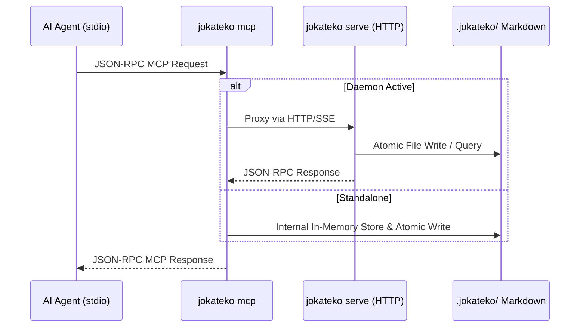

# Jokateko Model Context Protocol (MCP) Specification

This document specifies the Model Context Protocol (MCP) server architecture, tool signatures, resource definitions, prompt templates, and the stdio proxy model implemented in Jokateko using the official Go SDK (`modelcontextprotocol/go-sdk`).

---

## 1. Overview & Architectural Goals

Jokateko exposes a standard Model Context Protocol interface to empower AI coding agents (such as Cursor, Claude Desktop, Antigravity, and other MCP clients) to interact directly with the project Kanban and architecture specifications.

### Key Goals:
1. **Context Window Efficiency:** Tool responses prioritize compact, high-signal summaries (e.g. `list_tasks` returns only IDs, titles, summaries, statuses, and tags) to preserve agent context. Full specifications are loaded on-demand via `get_task`.
2. **Progressive Disclosure:** Architecture rules and strategies are tiered. Agents query `list_strategies` to view short summaries and tier levels, then fetch `get_strategy` for detailed guidelines only when relevant.
3. **Filesystem as Single Source of Truth:** Every MCP mutation (`create_task`, `update_task_status`, etc.) writes atomically to Markdown files on disk. In-memory SQLite is kept synchronized via `fsnotify`.

### 1.1 Safe Mutations via MCP (Never Raw Edits)
AI agents **must not** create, edit, or delete `.jokateko/` markdown files directly on disk. All mutations must be executed through the Jokateko MCP tools:
- **Integrity & Validation:** The MCP server validates tags against `tags.allowed`, enforces status column rules, checks priority validity, and checks milestone existence.
- **Workflow State Guards:** Prevents unauthorized edits to task bodies in non-editable states (`board.editable_states`), while allowing notes and checkbox toggles.
- **Cycle Detection:** Validates task dependency DAGs preventing circular references.
- **Atomic Operations:** Uses `internal/writer` with cache suppression to prevent file watcher echo loops and race conditions.
- **Real-Time UI Updates:** Dispatches Server-Sent Events (SSE) so browser clients reflect changes instantly.
- **Dynamic Tool Discovery:** Agents should inspect the active MCP server (`tools/list` or client registry) to discover all available tools, options, and schemas.

---

## 2. Server Operational Modes

### 2.1 Daemon Mode (`jokateko serve`)
When the primary daemon is started:
- Launches the HTTP REST, SSE, and health server on the configured port (default `8080`).
- Serves an MCP HTTP/SSE transport endpoint at `http://127.0.0.1:8080/api/mcp`.
- Exposes a lightweight health check at `GET /api/health` returning JSON metadata (version, status, uptime).
- Operates entirely without ephemeral lockfiles on disk.

### 2.2 Dedicated Stdio Command (`jokateko mcp`)
External agent environments typically launch MCP servers via standard input/output (`stdio`).
When `jokateko mcp` is executed:
1. **Checks for Running Daemon:** Sends a quick probe request to the configured daemon port (`GET http://127.0.0.1:<port>/api/health` with a 100ms timeout).
2. **If Daemon is Running (Proxy Mode):**
   - Operates as a lightweight stdio bridge.
   - Forwards agent JSON-RPC messages to the daemon's HTTP/SSE endpoint (`/api/mcp`).
   - Prevents port collision, duplicate file watchers, or duplicate in-memory SQLite instances.
3. **If Daemon is NOT Running (Standalone Mode):**
   - Initializes an in-memory SQLite store.
   - Scans and indexes `.jokateko/` files (`tasks/`, `milestones/`, `strategies/`, `glossary/`).
   - Starts an internal `fsnotify` watcher and MCP server bound to `os.Stdin` / `os.Stdout`.



---

## 3. MCP Tools Catalog

### 3.1 Task Tools

#### `list_tasks`
Lists tasks with optional filtering. Returns compact summaries.
- **Input Parameters:**
  - `status` (string, optional): Filter by status (`backlog`, `ready`, `in_progress`, `in_review`, `done`).
  - `milestone` (string, optional): Filter by milestone slug (e.g. `260915-mvp-release`).
  - `tag` (string, optional): Filter by tag name.
  - `priority` (string, optional): Filter by priority (`low`, `medium`, `high`, `critical`).
- **Output:**
  ```json
  [
    {
      "id": "260901-setup-database",
      "title": "Implement SQLite In-Memory Database Store",
      "status": "in_progress",
      "priority": "high",
      "milestone": "260915-mvp-release",
      "tags": ["backend", "database", "sqlite"],
      "summary": "Set up pure Go in-memory SQLite tables using modernc.org/sqlite and sqlc.",
      "dependencies": ["260901-project-scaffolding"]
    }
  ]
  ```

#### `get_task`
Fetches the complete task specification including full Markdown body and acceptance criteria.
- **Input Parameters:**
  - `id` (string, required): The task ID or slug (e.g. `260901-setup-database`).
- **Output:**
  ```json
  {
    "id": "260901-setup-database",
    "title": "Implement SQLite In-Memory Database Store",
    "status": "in_progress",
    "priority": "high",
    "milestone": "260915-mvp-release",
    "tags": ["backend", "database", "sqlite"],
    "summary": "Set up pure Go in-memory SQLite tables using modernc.org/sqlite and sqlc.",
    "dependencies": ["260901-project-scaffolding"],
    "body": "## Description\nWe need a pure Go in-memory SQLite store...\n\n## Acceptance Criteria\n- [ ] Uses modernc.org/sqlite..."
  }
  ```

#### `create_task`
Creates a new task file inside `.jokateko/tasks/`.
- **Input Parameters:**
  - `title` (string, required): Short, descriptive title.
  - `status` (string, optional): Column status (defaults to `default_create_state`, e.g. `backlog`).
  - `priority` (string, optional): `low` | `medium` | `high` | `critical` (default: `medium`).
  - `milestone` (string, optional): Associated milestone slug.
  - `reopen_milestone` (boolean, optional, default `false`): Required if attempting to attach a task to a milestone whose tasks are already 100% completed.
  - `tags` (array of strings, optional): Categorization tags. Must belong to `tags.allowed` if enforcement is enabled.
  - `summary` (string, required): 1-2 sentence high-level summary.
  - `dependencies` (array of strings, optional): Slugs of blocking tasks.
  - `body` (string, required): Markdown body detailing description and acceptance criteria.
- **Behavior:**
  - **Controlled Tag Enforcement:** If `tags.enforce_allowed` is enabled in `config.toml`, rejects any tags not in the allowed list with an error detailing valid tags.
  - **Closed Milestone Guard:** If `milestone` is specified and that milestone is completed/archived (all existing tasks are done), rejects with an error unless `reopen_milestone: true` is explicitly provided.
  - Generates filename using current date and title slug: `YYMMDD-<slug>.md`.
  - Atomically writes the file to `.jokateko/tasks/`.
  - Returns created task details and assigned ID.

#### `update_task_status`
Transitions a task to a different workflow column (e.g. `ready`, `in_progress`, `in_review`).
- **Input Parameters:**
  - `id` (string, required): Task slug (e.g. `260901-setup-database`).
  - `status` (string, required): Target column status (e.g. `ready`, `in_progress`, `in_review`).
- **Behavior:**
  - Validates that `status` exists in `config.toml` board columns.
  - **Strict 'Done' Guard:** If `status == "done"`, this tool **strictly rejects** the call with code/error:
    `"Cannot set status to 'done' directly via update_task_status. You must invoke the complete_task tool to document what was done, why it was done, and provide an updated summary."`
  - Reads existing file, updates YAML frontmatter `status` field, and atomically overwrites file.

#### `complete_task`
Marks a task as completed while strictly enforcing documentation and dependency integrity.
- **Input Parameters:**
  - `id` (string, required): Task slug (e.g. `260901-setup-database`).
  - `summary` (string, required): Updated 1-2 sentence high-level summary reflecting the completed state.
  - `what_done` (string, required): Detailed technical description of what code, features, or fixes were implemented.
  - `why_done` (string, required): Architectural reasoning, design decisions, and rationale for how the task was solved.
  - `ignore_dependencies` (boolean, optional, default `false`): Force completion even if blocking dependencies are not yet `done`.
- **Behavior & Execution Steps:**
  1. **Dependency Safety Verification:**
     - Inspects all slugs in the task's `dependencies` list.
     - If any blocking task is not yet in `status: "done"`, rejects completion with an actionable error listing the unresolved blockers (unless `ignore_dependencies: true` is passed).
  2. **Acceptance Criteria Verification (Strict Open Checkbox Guard):**
     - Inspects all checklist items in the task Markdown body.
     - If any uncompleted checkboxes (`- [ ]`) remain, completion is **strictly rejected** with an actionable error:
       `"Cannot complete task: <N> acceptance criteria items remain uncompleted. Use list_task_items to view remaining items and update_task_item to mark them as completed before completing the task."`
     - Tasks with 0 checkboxes pass this check immediately.
  3. **Structured Completion Documentation:**
     - Appends a standardized `## Completion Summary` section to the end of the Markdown body:
       ```markdown
       ## Completion Summary
       - **Completed At:** 2026-09-01T07:15:00Z

       ### What Was Done
       <what_done>

       ### Why / Rationale
       <why_done>
       ```
  4. **Frontmatter Update:**
     - Updates frontmatter: `status: "done"` and `summary: <summary>`.
  5. **Atomic File Persistence:**
     - Atomically writes the updated markdown file to disk via `internal/writer/`.
  6. **Downstream Unblock Detection:**
     - Queries in-memory SQLite for any tasks that were blocked by this task and now have all their dependencies satisfied.
- **Output:**
  ```json
  {
    "success": true,
    "id": "260901-setup-database",
    "status": "done",
    "summary": "Pure Go in-memory SQLite store implemented with modernc.org/sqlite and sqlc migrations.",
    "unblocked_tasks": [
      {
        "id": "260902-auth-endpoints",
        "title": "Implement User Authentication Endpoints",
        "status": "ready"
      }
    ],
    "message": "Task 260901-setup-database marked as done. 1 downstream task unblocked."
  }
  ```

#### `list_task_items`
Lists all acceptance criteria and checklist items from a task's Markdown body with their 1-based index and completion status.
- **Input Parameters:**
  - `id` (string, required): Task slug (e.g. `260901-setup-database`).
- **Behavior:**
  - Reads the task specification and parses all markdown checklist items.
  - Returns each item with its 1-based `index`, `completed` state, and `text` label.
- **Output:**
  ```json
  {
    "id": "260901-setup-database",
    "total": 3,
    "completed": 1,
    "items": [
      {
        "index": 1,
        "text": "Pure Go modernc.org/sqlite implementation",
        "completed": true
      },
      {
        "index": 2,
        "text": "In-memory database connection pool",
        "completed": false
      },
      {
        "index": 3,
        "text": "sqlc schema and queries generated",
        "completed": false
      }
    ]
  }
  ```

#### `update_task_item`
Updates the completion status of a specific checklist item in a task's Markdown body by its 1-based index.
- **Input Parameters:**
  - `id` (string, required): Task slug (e.g. `260901-setup-database`).
  - `index` (integer, required): 1-based item index returned by `list_task_items`.
  - `completed` (boolean, required): `true` to check the box (`- [x]`), `false` to uncheck (`- [ ]`).
- **Behavior:**
  - Validates that `index` is within the bounds of the task's checklist items (`1 <= index <= total`).
  - Rewrites the target checkbox state in the markdown body without disturbing other content.
  - Atomically saves the file and updates task criteria metrics in the database.
- **Output:**
  ```json
  {
    "id": "260901-setup-database",
    "index": 2,
    "text": "In-memory database connection pool",
    "completed": true,
    "total_items": 3,
    "completed_items": 2
  }
  ```

#### `update_task_content`
Updates metadata fields and/or the Markdown body of an existing task.
- **Input Parameters:**
  - `id` (string, required): Task slug.
  - `title` (string, optional)
  - `summary` (string, optional)
  - `priority` (string, optional)
  - `milestone` (string, optional)
  - `reopen_milestone` (boolean, optional, default `false`): Required if moving this task to an already completed milestone.
  - `tags` (array of strings, optional): Must belong to `tags.allowed` if enforcement is enabled.
  - `dependencies` (array of strings, optional)
  - `body` (string, optional): New Markdown body.
- **Behavior:**
  - Enforces `tags.allowed` validation if tags are updated.
  - Enforces `Closed Milestone Guard` if milestone is changed.
  - Enforces `board.editable_states` (default `["backlog"]`): if the task is in a non-editable state, rewriting the specification body is rejected unless it is solely a checkbox state toggle (`- [ ]` <-> `- [x]`).
  - Updates specified fields while preserving existing unmodified fields.
  - Atomically rewrites file to disk.

#### `add_task_note`
Appends a timestamped note and optional follow-up checklist items to an existing task under a `## Notes` section. Usable in all workflow states.
- **Input Parameters:**
  - `id` (string, required): Task slug.
  - `note` (string, required): Markdown note text to append.
- **Behavior:**
  - Formats note with an ISO UTC timestamp: `### [YYYY-MM-DD HH:MM UTC]\n\n<note>\n`.
  - Appends to or creates a `## Notes` section at the end of the task specification.
  - Recounts acceptance criteria: any checklist items (`- [ ]`) in the note are tracked as required criteria and block `complete_task` until resolved.
  - Atomically saves the task file and updates store metrics.
- **Output:**
  ```json
  {
    "success": true,
    "id": "260901-setup-database",
    "note": "Investigation complete.\n- [ ] Check migration edge cases",
    "total_criteria": 3,
    "completed_criteria": 2,
    "message": "Note added to task 260901-setup-database"
  }
  ```

#### `add_task_dependency`
Adds a prerequisite dependency to a task, enforcing directed acyclic graph (DAG) cycle prevention.
- **Input Parameters:**
  - `id` (string, required): Task slug that will depend on `dependency_id`.
  - `dependency_id` (string, required): Task slug of the prerequisite task.
- **Behavior:**
  - Validates that both tasks exist.
  - Rejects self-dependencies (`id == dependency_id`).
  - Detects and rejects direct circular dependencies (`A -> B -> A`) and transitive cycles (`A -> B -> C -> A`).
  - Idempotent: adding an already existing dependency succeeds without duplicates.
  - Atomically writes updated `dependencies` to task frontmatter and updates SQLite DAG cache.
- **Output:**
  ```json
  {
    "success": true,
    "id": "260902-auth-endpoints",
    "dependency_id": "260901-setup-database",
    "dependencies": ["260901-setup-database"],
    "message": "Added dependency 260901-setup-database to task 260902-auth-endpoints"
  }
  ```

#### `remove_task_dependency`
Removes a prerequisite dependency from a task.
- **Input Parameters:**
  - `id` (string, required): Task slug.
  - `dependency_id` (string, required): Prerequisite task slug to remove.
- **Behavior:**
  - Validates that the task exists and that `dependency_id` is an active dependency.
  - Removes the dependency from the task frontmatter and atomically saves the file.
- **Output:**
  ```json
  {
    "success": true,
    "id": "260902-auth-endpoints",
    "dependency_id": "260901-setup-database",
    "dependencies": [],
    "message": "Removed dependency 260901-setup-database from task 260902-auth-endpoints"
  }
  ```

#### `delete_task`
Deletes a task Markdown file and removes it from the store with downstream dependency safety checks.
- **Input Parameters:**
  - `id` (string, required): Task slug.
  - `force` (boolean, optional, default `false`): Delete even if other tasks depend on this task.
- **Behavior:**
  - If other tasks depend on this task and `force=false`, deletion is blocked with a descriptive error listing the downstream tasks.
  - When `force=true`, downstream tasks are updated to clean up the removed dependency.
  - Atomically deletes the file from disk and SQLite.
- **Output:**
  ```json
  {
    "success": true,
    "id": "260901-setup-database",
    "message": "Task \"260901-setup-database\" deleted successfully"
  }
  ```

---

### 3.2 Milestone Tools

#### `list_milestones`
Lists milestones with calculated completion metrics.
- **Input Parameters:**
  - `include_archived` (boolean, optional, default `false`): By default, completed milestones are hidden. Pass `true` to include archived milestones.
- **Auto-Archive & Visibility Behavior:**
  - **Auto-Archived When Completed:** If a milestone has at least one task, and 100% of its assigned tasks are in `status: "done"`, it is automatically classified as **archived / closed** and hidden from default listings.
  - **Open by Default:** If a milestone has 0 assigned tasks, it remains **open** and visible.
- **Output:**
  ```json
  [
    {
      "id": "260915-mvp-release",
      "title": "MVP Release",
      "status": "open",
      "is_archived": false,
      "target_date": "2026-09-15",
      "total_tasks": 12,
      "completed_tasks": 8,
      "progress_percentage": 66.7,
      "summary": "Core local daemon with file watcher, in-memory SQLite, and live Preact Kanban board."
    }
  ]
  ```

#### `get_milestone`
Fetches full milestone specification and all assigned task slugs.
- **Input Parameters:**
  - `id` (string, required): Milestone slug.

#### `create_milestone`
Creates a new milestone file in `.jokateko/milestones/YYMMDD-<slug>.md`.
- **Input Parameters:**
  - `title` (string, required)
  - `target_date` (string, optional): ISO date (`YYYY-MM-DD`).
  - `summary` (string, required)
  - `body` (string, optional)

#### `update_milestone`
Updates milestone metadata fields (e.g. status transition between `open` and `closed`, target date, summary, or body).
- **Input Parameters:**
  - `id` (string, required): Milestone slug.
  - `status` (string, optional): `open` | `closed`.
  - `target_date` (string, optional): ISO date (`YYYY-MM-DD`).
  - `summary` (string, optional)
  - `body` (string, optional)
- **Behavior:**
  - Updates specified fields while preserving existing unmodified frontmatter.
  - Atomically overwrites file on disk.

#### `delete_milestone`
Deletes a milestone Markdown file and removes it from the store with task assignment protection.
- **Input Parameters:**
  - `id` (string, required): Milestone slug.
  - `force` (boolean, optional, default `false`): Delete even if tasks are currently attached to this milestone.
- **Behavior:**
  - If tasks are attached to this milestone and `force=false`, deletion is blocked with an error listing the attached tasks.
  - When `force=true`, assigned tasks have their milestone association cleared.
  - Atomically deletes the milestone file from disk and store.
- **Output:**
  ```json
  {
    "success": true,
    "id": "260915-mvp-release",
    "message": "Milestone \"260915-mvp-release\" deleted successfully"
  }
  ```

---

### 3.3 Strategy & Progressive Disclosure Tools

#### `list_strategies` (Tier 1 Discovery)
Returns high-level summaries of architectural guidelines so agents can decide which are relevant.
- **Input Parameters:**
  - `tier` (integer, optional): Filter by tier (1: Core, 2: Domain, 3: Deep implementation).
  - `tag` (string, optional): Filter by topic tag (e.g. `database`, `security`).
- **Output:**
  ```json
  [
    {
      "id": "architecture",
      "title": "Zero CGO and Single Executable Architecture",
      "tier": 1,
      "tags": ["architecture", "go", "dependencies"],
      "summary": "All Go code must cross-compile cleanly without CGO or external system libraries."
    }
  ]
  ```

#### `get_strategy` (Tier 2/3 Detailed Spec)
Retrieves the full markdown document of a specific architectural strategy.
- **Input Parameters:**
  - `id` (string, required): Strategy slug (e.g. `architecture`).

#### `create_strategy`
Creates a new architectural guideline or decision record markdown file inside `.jokateko/strategies/`.
- **Input Parameters:**
  - `title` (string, required): Descriptive title for the guideline.
  - `tier` (integer, required): Architectural tier (1: Core Invariants, 2: Domain Patterns, 3: Implementation Specs).
  - `summary` (string, required): 1-2 sentence high-level summary.
  - `tags` (array of strings, optional): Categorization tags.
  - `body` (string, optional): Full Markdown body detailing architectural guidelines, rules, and invariants.
- **Behavior:**
  - Auto-slugifies filename from title.
  - Atomically writes file to disk and indexes in SQLite.

#### `update_strategy`
Updates metadata or content of an existing strategy.
- **Input Parameters:**
  - `id` (string, required): Strategy slug.
  - `title` (string, optional)
  - `tier` (integer, optional): 1, 2, or 3.
  - `summary` (string, optional)
  - `tags` (array of strings, optional)
  - `body` (string, optional)

#### `delete_strategy`
Deletes an architectural strategy file and removes it from the store.
- **Input Parameters:**
  - `id` (string, required): Strategy slug.
- **Output:**
  ```json
  {
    "success": true,
    "id": "architecture",
    "message": "Strategy \"architecture\" deleted successfully"
  }
  ```

---

### 3.4 Glossary & Board State Tools

#### `lookup_glossary`
Looks up standardized project terms.
- **Input Parameters:**
  - `term` (string, optional): Specific term to find. If omitted, returns all terms and definitions.

#### `create_glossary_term`
Creates a new project glossary term markdown file inside `.jokateko/glossary/`.
- **Input Parameters:**
  - `title` (string, required): Term title or name.
  - `summary` (string, required): Short definition of the term.
  - `tags` (array of strings, optional): Categorization tags.
  - `body` (string, optional): Extended markdown description, examples, or notes.

#### `update_glossary_term`
Updates definition, summary, or body of an existing glossary term.
- **Input Parameters:**
  - `id` (string, required): Glossary term slug.
  - `title` (string, optional)
  - `summary` (string, optional)
  - `tags` (array of strings, optional)
  - `body` (string, optional)

#### `delete_glossary_term`
Deletes a glossary term file and removes it from the store.
- **Input Parameters:**
  - `id` (string, required): Glossary term slug.
- **Output:**
  ```json
  {
    "success": true,
    "id": "tasks-as-code",
    "message": "Glossary term \"tasks-as-code\" deleted successfully"
  }
  ```

#### `get_board_state`
Returns column hierarchy and aggregated task counts.
- **Output:**
  ```json
  {
    "project_name": "Jokateko",
    "columns": [
      { "id": "backlog", "name": "Backlog", "color": "#94a3b8", "count": 4, "handled_by": "human", "instructions": "Triage, requirement gathering, and spec definition" },
      { "id": "ready", "name": "Ready", "color": "#60a5fa", "count": 2, "handled_by": "agent:coder" },
      { "id": "in_progress", "name": "In Progress", "color": "#f59e0b", "count": 1, "handled_by": "agent:coder" },
      { "id": "in_review", "name": "In Review", "color": "#a855f7", "count": 1, "handled_by": "agent:reviewer", "instructions": "Requires verification, testing, and human review before completion" },
      { "id": "done", "name": "Done", "color": "#10b981", "count": 15 }
    ]
  }
  ```

---

### 3.5 SQLite Full-Text Search Tools

Jokateko provides dedicated search tools for each content type, plus a universal search tool when an agent does not know where to start:

#### `search_tasks`
Searches task titles, summaries, acceptance criteria, and completion notes in SQLite.
- **Input Parameters:**
  - `query` (string, required): Search keywords or phrases.
  - `tag` (string, optional): Restrict matches to tasks with this tag.
  - `limit` (integer, optional, default `20`): Maximum results to return.
- **Output:**
  ```json
  [
    {
      "id": "260901-setup-database",
      "title": "Implement SQLite In-Memory Database Store",
      "status": "done",
      "priority": "high",
      "tags": ["backend", "database", "sqlite"],
      "snippet": "Set up pure Go in-memory SQLite tables using <mark>modernc.org/sqlite</mark> and sqlc.",
      "score": 0.95
    }
  ]
  ```

#### `search_milestones`
Searches milestone titles, goals, and summaries.
- **Input Parameters:**
  - `query` (string, required): Search keywords.
  - `tag` (string, optional): Restrict matches to milestones with this tag.
  - `limit` (integer, optional, default `20`).
- **Output:**
  ```json
  [
    {
      "id": "260915-mvp-release",
      "title": "MVP Release",
      "status": "open",
      "target_date": "2026-09-15",
      "tags": ["release", "mvp"],
      "snippet": "Core local daemon with file watcher, in-memory <mark>SQLite</mark>, and live Preact Kanban board.",
      "score": 0.88
    }
  ]
  ```

#### `search_strategies`
Searches architectural guideline titles, rule descriptions, and summaries.
- **Input Parameters:**
  - `query` (string, required): Search keywords.
  - `tag` (string, optional): Restrict matches to strategies with this tag.
  - `limit` (integer, optional, default `20`).
- **Output:**
  ```json
  [
    {
      "id": "architecture",
      "title": "Zero CGO and Single Executable Architecture",
      "tier": 1,
      "tags": ["architecture", "go", "dependencies"],
      "snippet": "All Go code must cross-compile cleanly without <mark>CGO</mark> or external system libraries.",
      "score": 0.92
    }
  ]
  ```

#### `search_glossary`
Searches standardized project terminology, terms, and conceptual definitions.
- **Input Parameters:**
  - `query` (string, required): Search keywords.
  - `tag` (string, optional): Restrict matches to glossary terms with this tag.
  - `limit` (integer, optional, default `20`).
- **Output:**
  ```json
  [
    {
      "id": "in-memory-query-index",
      "title": "In-Memory Query Index",
      "tags": ["backend", "database"],
      "snippet": "The ephemeral <mark>SQLite</mark> database running inside the Jokateko daemon...",
      "score": 0.82
    }
  ]
  ```

#### `search_all`
Universal full-text search across all document types (tasks, milestones, strategies, and glossary) when the agent does not know where to begin.
- **Input Parameters:**
  - `query` (string, required): Search keywords or phrases.
  - `tag` (string, optional): Restrict matches to documents with this tag.
  - `limit` (integer, optional, default `20`).
- **Output:**
  ```json
  [
    {
      "id": "260901-setup-database",
      "type": "task",
      "title": "Implement SQLite In-Memory Database Store",
      "tags": ["backend", "database", "sqlite"],
      "snippet": "Set up pure Go in-memory SQLite tables using <mark>modernc.org/sqlite</mark>...",
      "score": 0.95
    },
    {
      "id": "in-memory-query-index",
      "type": "glossary",
      "title": "In-Memory Query Index",
      "tags": ["backend", "database"],
      "snippet": "The ephemeral <mark>SQLite</mark> database running inside the Jokateko daemon...",
      "score": 0.82
    }
  ]
  ```

---

### 3.6 Tag Management Tools

#### `list_tags`
Lists the controlled vocabulary of tags configured in `config.toml`, along with their usage counts across tasks, milestones, and strategies. AI agents should call this tool before assigning tags to tasks or milestones.
- **Output:**
  ```json
  {
    "enforced": true,
    "tags": [
      { "tag": "backend", "task_count": 8, "milestone_count": 1, "strategy_count": 2 },
      { "tag": "frontend", "task_count": 6, "milestone_count": 1, "strategy_count": 1 },
      { "tag": "database", "task_count": 3, "milestone_count": 0, "strategy_count": 1 },
      { "tag": "security", "task_count": 2, "milestone_count": 0, "strategy_count": 1 },
      { "tag": "ui", "task_count": 5, "milestone_count": 1, "strategy_count": 0 },
      { "tag": "auth", "task_count": 2, "milestone_count": 0, "strategy_count": 0 },
      { "tag": "api", "task_count": 4, "milestone_count": 0, "strategy_count": 0 },
      { "tag": "docs", "task_count": 3, "milestone_count": 0, "strategy_count": 1 },
      { "tag": "testing", "task_count": 4, "milestone_count": 0, "strategy_count": 0 },
      { "tag": "release", "task_count": 1, "milestone_count": 2, "strategy_count": 0 },
      { "tag": "infra", "task_count": 1, "milestone_count": 0, "strategy_count": 1 }
    ]
  }
  ```

---

## 4. MCP Resources

Agents can subscribe to read-only URI resources:
- `jokateko://board`: Live snapshot of board columns and task states.
- `jokateko://strategies/tier1`: Concatenation of all Tier-1 architectural rules.
- `jokateko://glossary`: Project glossary dictionary.

---

## 5. MCP Prompts

### `next_task`
Generates a prompt payload to guide an AI agent on what to work on next.
- Analyzes tasks in the `ready` column.
- Verifies that all items in `dependencies` are in `done` status.
- Recommends the highest-priority task and includes summaries of relevant Tier-1 strategies.
