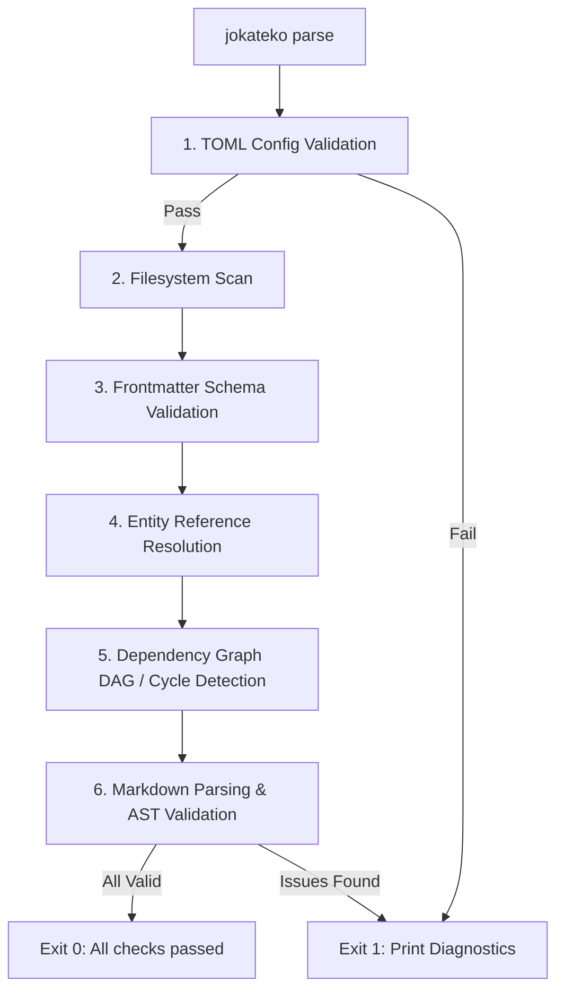

# Jokateko Validation & Linting Engine

This document specifies the validation engine executed by `jokateko parse` (and `jokateko lint`). It provides deterministic automated feedback for both human developers and AI agents to ensure that repository markdown files and configurations remain strictly valid.

---

## 1. Objectives & Exit Codes

The `jokateko parse` command performs a strict dry-run validation without launching servers or modifying files.

- **Exit Code `0`:** Project is completely valid. No errors detected.
- **Exit Code `1`:** One or more validation errors found. Detailed diagnostics are printed to `stderr`.

---

## 2. Validation Checks & Rule Hierarchy



---

## 3. Detailed Validation Rules

### 3.1 Configuration Rules (`config.toml`)

| Rule ID | Name | Severity | Description |
|---|---|---|---|
| `CFG-001` | `toml-syntax` | Error | File is valid TOML and conforms to the `Config` schema. |
| `CFG-002` | `column-min` | Error | At least two columns must be defined under `[[board.columns]]`. |
| `CFG-003` | `column-unique-id` | Error | Every column must have a unique, non-empty `id`. |
| `CFG-004` | `port-range` | Error | `server.port` must be between 1024 and 65535. |
| `CFG-005` | `path-traversal` | Error | Configured paths must not escape the workspace directory. |

---

### 3.2 Task Validation Rules (`.jokateko/tasks/*.md`)

| Rule ID | Name | Severity | Description |
|---|---|---|---|
| `TSK-001` | `filename-format` | Warning | Filename should follow `YYMMDD-short-title.md`. |
| `TSK-002` | `yaml-frontmatter` | Error | File must start with `---` and contain parseable YAML frontmatter. |
| `TSK-003` | `required-fields` | Error | Frontmatter must contain `title` and `summary`. |
| `TSK-004` | `valid-status` | Error | Frontmatter `status` must match a valid `id` in `config.toml` columns. |
| `TSK-005` | `valid-priority` | Warning | If set, `priority` must be one of: `low`, `medium`, `high`, `critical`. |
| `TSK-006` | `milestone-exists` | Error | If `milestone` is specified, the referenced milestone file must exist. |
| `TSK-007` | `dependencies-exist`| Error | All slugs in `dependencies` must correspond to existing task files. |
| `TSK-008` | `no-self-dependency`| Error | A task cannot list its own slug in `dependencies`. |
| `TSK-009` | `allowed-tags`      | Error | If `tags.enforce_allowed` is true, all task tags must exist in `tags.allowed`. |

---

### 3.3 Milestone Validation Rules (`.jokateko/milestones/*.md`)

| Rule ID | Name | Severity | Description |
|---|---|---|---|
| `MLS-001` | `filename-format` | Warning | Filename should follow `YYMMDD-short-title.md`. |
| `MLS-002` | `yaml-frontmatter` | Error | Frontmatter must be valid YAML. |
| `MLS-003` | `required-fields` | Error | Frontmatter must contain `title` and `summary`. |
| `MLS-004` | `date-format` | Warning | `target_date` must match ISO-8601 (`YYYY-MM-DD`). |
| `MLS-005` | `allowed-tags` | Error | If `tags.enforce_allowed` is true, all milestone tags must exist in `tags.allowed`. |

---

### 3.4 Strategy Validation Rules (`.jokateko/strategies/*.md`)

| Rule ID | Name | Severity | Description |
|---|---|---|---|
| `STR-001` | `yaml-frontmatter` | Error | Frontmatter must be valid YAML. |
| `STR-002` | `required-fields` | Error | Frontmatter must contain `title`, `tier`, and `summary`. |
| `STR-003` | `valid-tier` | Error | `tier` must be an integer: `1` (Core), `2` (Domain), or `3` (Implementation). |
| `STR-004` | `allowed-tags` | Error | If `tags.enforce_allowed` is true, all strategy tags must exist in `tags.allowed`. |

---

### 3.5 Glossary Validation Rules (`.jokateko/glossary/*.md`)

| Rule ID | Name | Severity | Description |
|---|---|---|---|
| `GLS-001` | `yaml-frontmatter` | Error | Frontmatter must be valid YAML. |
| `GLS-002` | `required-fields` | Error | Frontmatter must contain `title` and `summary`. |
| `GLS-003` | `unique-term` | Error | Each glossary term file must have a unique `title` across the project. |
| `GLS-004` | `allowed-tags` | Error | If `tags.enforce_allowed` is true, all glossary tags must exist in `tags.allowed`. |

---

### 3.6 Tag Vocabulary Validation Rules (`config.toml`)

| Rule ID | Name | Severity | Description |
|---|---|---|---|
| `TAG-001` | `kebab-case-tags` | Error | All tags in `tags.allowed` must be lowercase alphanumeric with hyphens. |
| `TAG-002` | `unique-tags` | Error | The `tags.allowed` list must not contain duplicate tag names. |

---

### 3.7 Dependency Graph & Cycle Detection (`DAG-001`)

Tasks form a directed dependency graph where an edge $(A \to B)$ signifies that task $A$ is blocked by task $B$.

- **Invariant:** The graph must be a **Directed Acyclic Graph (DAG)**.
- **Algorithm:** Depth-First Search (DFS) with three-color node marking (White = unvisited, Gray = visiting, Black = visited):
  1. If traversal reaches a **Gray** node, a cycle is detected.
  2. The cycle path is reconstructed (e.g. `task-A -> task-B -> task-C -> task-A`).
  3. Emits error `DAG-001: Circular task dependency detected: task-A -> task-B -> task-A`.

---

## 4. Diagnostic CLI Output Format

Jokateko formats errors similarly to modern compilers, including file paths, rule IDs, and remediation instructions:

```text
$ jokateko parse

[FAIL] Found 2 errors and 1 warning during validation:

ERROR [TSK-004] .jokateko/tasks/260901-auth-endpoints.md:4
  Invalid status: "review"
  Allowed column statuses: [backlog, ready, in_progress, in_review, done]
  Fix: Update 'status: "in_review"' in frontmatter.

ERROR [DAG-001] .jokateko/tasks/260902-database-schema.md
  Circular dependency detected:
  260902-database-schema.md -> 260903-migration-runner.md -> 260902-database-schema.md
  Fix: Remove the circular reference from 'dependencies' in one of these tasks.

WARNING [TSK-001] .jokateko/tasks/setup.md
  Filename does not follow standard date convention.
  Recommendation: Rename file to 'YYMMDD-setup.md' (e.g. '260901-setup.md').

Validation failed with 2 errors. Exiting with code 1.
```

When all checks succeed:
```text
$ jokateko parse

[OK] Validation successful:
  ✓ Configuration: .jokateko/config.toml (5 columns defined)
  ✓ Tasks: 18 files parsed (0 errors, 0 cycle conflicts)
  ✓ Milestones: 3 files parsed
  ✓ Strategies: 4 guidelines validated (Tier 1: 2, Tier 2: 1, Tier 3: 1)
  ✓ Glossary: 14 terms validated (0 errors)

Project is healthy. Exiting with code 0.
```
