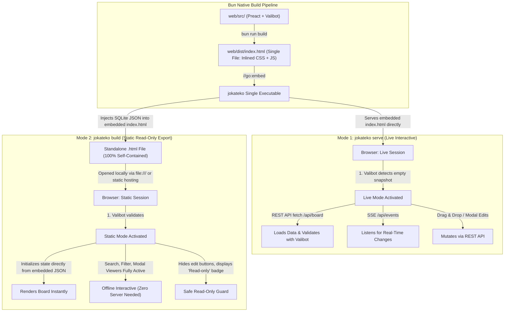

# Jokateko Web UI Architecture

This document specifies the Web UI architecture, build pipeline, interactive runtime modes, snapshot injection mechanism, and automated E2E testing strategy.

---

## 1. Core Principles & Stack

- **Framework:** Preact (Fast, lightweight 3kB virtual DOM alternative to React).
- **Schema Validation & Type-Safety:** Valibot (Tree-shakeable, modular schema validation for snapshot JSON, REST payloads, and SSE events).
- **Bundler:** Bun 1.4 native bundler (`bun build`). Bun produces a **single, self-contained `index.html` file** with CSS and JS inlined at build time. Go never performs HTML/CSS/JS concatenation at runtime.
- **Styling:** Tailwind CSS Standalone CLI (Zero Node.js/NPM dependencies).
- **Embedded Binary Distribution:** Go compiler embeds `web/dist/index.html` into the binary via `//go:embed`.
- **E2E Testing:** Playwright targeting explicit `data-testid` attributes.

---

## 2. Interactive `serve` vs. Static `build` Architecture

### The Question:
> *"How to make Web UI interactive when 'serve', but static when 'build'. Do we need two different templates?"*

### The Solution: Single Preact Bundle with Snapshot Injection
**No, two different templates are NOT needed.** A single Preact SPA bundle compiled into a single HTML file by Bun serves both operational modes cleanly.



### 2.1 How Single-File Bundling & Snapshot Injection Work

1. **Bun Bundles All Assets into a Single `index.html`:**
   During project compilation, Bun executes `web/scripts/bundle.ts`:
   - Runs Tailwind CSS CLI to generate minified styles.
   - Bundles and minifies Preact and Valibot into a single JS script.
   - Inlines the CSS inside a `<style>` tag and the JS inside a `<script>` tag within `web/dist/index.html`.
   - Leaves a single placeholder for project data:
     ```html
     <!-- DATA_INJECTION_POINT -->
     <script id="jokateko-data" type="application/json">
     /* JOKATEKO_PAYLOAD_PLACEHOLDER */
     </script>
     ```

2. **In `serve` Mode:**
   - Go serves `web/dist/index.html` directly from `//go:embed`.
   - The payload script tag contains only the comment placeholder.
   - Valibot detects that no embedded snapshot is present.
   - Preact boots in **Live Mode**:
     - Fetches `/api/board` via REST and validates the response using `v.safeParse(BoardPayloadSchema, data)`.
     - Establishes `new EventSource("/api/events")` to receive real-time server pushes.
     - Enables task creation, card editing, and drag-and-drop column transitions.

3. **In `build` Mode (Zero Go Inlining Overhead):**
   - Because Bun already inlined all CSS and JS into `web/dist/index.html`, Go's `internal/exporter/` has zero bundling overhead.
   - The Go CLI simply:
     1. Serializes the current in-memory SQLite state to minified JSON.
     2. Replaces `/* JOKATEKO_PAYLOAD_PLACEHOLDER */` in the embedded `index.html` with the JSON payload.
     3. Writes the output file (e.g. `dist-kanban/index.html` or custom `--out` path).
   - When opened in any browser (even via `file:///` without internet):
     - Valibot validates the embedded JSON snapshot on startup.
     - Preact boots in **Static Mode** with all search, filtering, and modal preview features enabled.

### 2.2 Mermaid Runtime (Lazy, Pinned, SRI-Verified)

Mermaid and its dependencies make up ~95% of the UI's JavaScript (~5.5 MB vs ~0.3 MB for the app). To keep startup fast, Mermaid is **not** part of the inlined app bundle. All modes use the same published, self-contained `mermaid/dist/mermaid.min.js` from the `bun.lock`-pinned package. `bundle.ts` computes its SHA-384 SRI hash at build time and writes `web/dist/mermaid.min.js.gz` and `web/dist/mermaid.json` (`{ version, integrity }`), both embedded in the binary. `web/src/utils/mermaidLoader.ts` loads the runtime only when the first diagram is rendered:

| Mode | Selected by | Source | Verification |
|---|---|---|---|
| `serve` (live) | default | `GET /assets/mermaid-<version>.min.js` (embedded, gzip, immutable cache) | SRI `integrity` attribute; the hash is also added to CSP `script-src` |
| `build --mermaidjs=cdn` (default) | `<meta name="jokateko-mermaid" content="cdn">` | `https://cdn.jsdelivr.net/npm/mermaid@<version>/dist/mermaid.min.js` | SRI + `crossorigin="anonymous"` (jsDelivr serves the npm file byte-for-byte) |
| `build --mermaidjs=bundled` | `<meta … content="bundled">` | inert `<script type="text/plain" id="jokateko-mermaid-src">` block, executed on first use | embedded bytes |
| `build --mermaidjs=none` | `<meta … content="none">` | none: Mermaid code blocks stay as code | n/a |

If the runtime cannot be loaded (offline CDN, SRI mismatch), the raw code blocks are kept. Upgrading Mermaid is an explicit `bun update mermaid`; the version, CDN URL and hash follow automatically from the lockfile.

**Licenses:** `cmd/genlicenses` lists only our main packages: the `dependencies` in `web/package.json` and the direct (non-`// indirect`) `go.mod` requires linked into the binary, not their transitive dependencies. Mermaid is a main package, so its license is shown in every `--mermaidjs` mode, including `none`.

---

## 3. UI Component Architecture

```text
<App>
├── <Header>
│   ├── Project Title & Version
│   ├── Mode Badge ("Live Daemon" vs "Static Snapshot")
│   └── Navigation Tabs ("Board", "Milestones", "Strategies", "Glossary")
├── <FilterBar>
│   ├── Search Input (real-time text matching across titles & summaries)
│   ├── Tag Multi-Select Filter
│   ├── Milestone Filter Dropdown
│   └── Priority Filter (Low, Medium, High, Critical)
└── <MainView>
    ├── <KanbanBoard> (Active when Tab = "Board")
    │   └── <Column> (Backlog, Ready, In Progress, In Review, Done)
    │       ├── Column Header (Name, Color Bar, Task Count)
    │       └── <TaskCard> (Title, Priority Badge, Tags, Summary, Dependencies)
    ├── <MilestonesView> (Active when Tab = "Milestones")
    │   └── <MilestoneCard> (Target Date, Progress Bar, Completed / Total Tasks)
    ├── <StrategiesView> (Active when Tab = "Strategies")
    │   └── <StrategyItem> (Tier Badge, Title, Summary, Expandable Full Spec)
    └── <GlossaryView> (Active when Tab = "Glossary")
        └── <GlossaryTerm> (Term Title, Definition)
└── <Modals>
    ├── <TaskDetailModal> (Full markdown spec preview, acceptance criteria checkboxes)
    └── <TaskEditModal> (Form editor; only enabled in Live Mode)
```

---

## 4. Frontend State & Real-Time Synchronization (Live Mode)

```ts
// State structure
interface AppState {
  mode: "live" | "static";
  activeTab: "board" | "milestones" | "strategies" | "glossary";
  config: ProjectConfig;
  tasks: Task[];
  milestones: Milestone[];
  strategies: Strategy[];
  glossary: GlossaryTerm[];
  filters: {
    searchQuery: string;
    selectedTags: string[];
    selectedMilestone: string | null;
    selectedPriorities: string[];
  };
  activeTaskDetailId: string | null;
}
```

### SSE Connection Handler
In `live` mode, the frontend maintains a resilient SSE connection:
```ts
function initLiveUpdates() {
  const eventSource = new EventSource("/api/events");

  eventSource.addEventListener("task.updated", (event) => {
    const updatedTask = JSON.parse(event.data);
    updateTaskInStore(updatedTask);
  });

  eventSource.addEventListener("task.created", (event) => {
    const newTask = JSON.parse(event.data);
    addTaskToStore(newTask);
  });

  eventSource.addEventListener("task.deleted", (event) => {
    const { id } = JSON.parse(event.data);
    removeTaskFromStore(id);
  });

  eventSource.addEventListener("board.refresh", () => {
    refetchBoard();
  });
}
```

---

## 5. Runtime Schema Validation with Valibot (`web/src/schemas/`)

Valibot provides lightweight, tree-shakeable runtime schema validation and automated TypeScript type inference. It ensures that all data injected via `<script id="jokateko-data">` or received over REST/SSE conforms strictly to the expected contracts.

```ts
import * as v from "valibot";

export const TaskSchema = v.object({
  id: v.string(),
  title: v.string(),
  status: v.string(),
  priority: v.optional(v.picklist(["low", "medium", "high", "critical"]), "medium"),
  milestone: v.optional(v.nullable(v.string())),
  tags: v.array(v.string()),
  summary: v.string(),
  dependencies: v.optional(v.array(v.string()), []),
  body: v.optional(v.string(), ""),
});

export const MilestoneSchema = v.object({
  id: v.string(),
  title: v.string(),
  status: v.string(),
  is_archived: v.optional(v.boolean(), false),
  target_date: v.optional(v.nullable(v.string())),
  tags: v.array(v.string()),
  summary: v.string(),
  total_tasks: v.optional(v.number(), 0),
  completed_tasks: v.optional(v.number(), 0),
  progress_percentage: v.optional(v.number(), 0),
});

export const StrategySchema = v.object({
  id: v.string(),
  title: v.string(),
  tier: v.picklist([1, 2, 3]),
  tags: v.array(v.string()),
  summary: v.string(),
  body: v.optional(v.string(), ""),
});

export const GlossaryTermSchema = v.object({
  id: v.string(),
  title: v.string(),
  tags: v.array(v.string()),
  summary: v.string(),
  body: v.optional(v.string(), ""),
});

export const ColumnSchema = v.object({
  id: v.string(),
  name: v.string(),
  color: v.string(),
});

export const SnapshotSchema = v.object({
  config: v.object({
    project: v.object({ name: v.string(), description: v.optional(v.string(), "") }),
    board: v.object({ columns: v.array(ColumnSchema) }),
    tags: v.optional(v.object({ allowed: v.array(v.string()), enforce_allowed: v.boolean() })),
  }),
  tasks: v.array(TaskSchema),
  milestones: v.array(MilestoneSchema),
  strategies: v.array(StrategySchema),
  glossary: v.array(GlossaryTermSchema),
});

// Automatically inferred TypeScript types (Single source of truth)
export type Task = v.InferOutput<typeof TaskSchema>;
export type Milestone = v.InferOutput<typeof MilestoneSchema>;
export type Strategy = v.InferOutput<typeof StrategySchema>;
export type GlossaryTerm = v.InferOutput<typeof GlossaryTermSchema>;
export type Column = v.InferOutput<typeof ColumnSchema>;
export type Snapshot = v.InferOutput<typeof SnapshotSchema>;
```

### Diagnostic Error Boundary & Safe Parsing

```ts
export function loadSnapshotData(rawJson: unknown): Snapshot | null {
  const result = v.safeParse(SnapshotSchema, rawJson);

  if (!result.success) {
    const errorDetails = result.issues.map(
      (issue) => `${issue.path?.map((p) => p.key).join(".") || "root"}: ${issue.message}`
    );
    // Display non-fatal diagnostic warning banner in UI
    appStore.validationWarnings.value = errorDetails;
    console.warn("Valibot Schema Validation Issues:", errorDetails);
    
    // Graceful recovery: return partial/sanitized data so the board remains functional
    return (result.output as Snapshot) || null;
  }

  return result.output;
}
```

---

## 6. Build Automation (Bun Single-File Bundling)

Bun executes `web/scripts/bundle.ts` to assemble the entire frontend into a single `web/dist/index.html` file with inlined CSS and JS:

```json
{
  "name": "jokateko-web",
  "private": true,
  "dependencies": {
    "preact": "^10.26.0",
    "valibot": "^1.1.0"
  },
  "scripts": {
    "build": "bun run scripts/bundle.ts",
    "dev": "bun run scripts/dev.ts"
  }
}
```

### How `web/scripts/bundle.ts` Works:
1. Spawns `tailwindcss` CLI to produce minified CSS.
2. Invokes `Bun.build({ entrypoints: ['src/index.tsx'], minify: true })` to compile Preact and Valibot into a single JS string.
3. Reads `src/index.html`, replaces `<link rel="stylesheet">` with `<style>{css}</style>`, and replaces `<script src="...">` with `<script>{js}</script>`.
4. Writes `web/dist/index.html` containing the reserved `/* JOKATEKO_PAYLOAD_PLACEHOLDER */`.
5. Writes the separately loaded Mermaid runtime (`mermaid.min.js.gz`) and its `mermaid.json` manifest (version + SRI hash), see §2.2.

---

## 7. Playwright E2E Testing Strategy

To comply with `AGENTS.md`, all DOM elements requiring automated validation use explicit `data-testid` attributes:

| Element | `data-testid` Pattern |
|---|---|
| Navigation Tab | `data-testid="tab-board"`, `data-testid="tab-milestones"` |
| Search Input | `data-testid="search-input"` |
| Column Container | `data-testid="column-<column-id>"` (e.g. `data-testid="column-in_progress"`) |
| Task Card | `data-testid="task-card-<task-id>"` |
| Task Status Badge | `data-testid="task-status"` |
| Task Detail Modal | `data-testid="task-detail-modal"` |
| Static Mode Indicator | `data-testid="mode-indicator-static"` |
| Live Mode Indicator | `data-testid="mode-indicator-live"` |
| Diagnostic Error Banner| `data-testid="validation-error-banner"` |

Playwright tests run deterministically against both the live daemon and the static HTML export:
- Test 1: Verify all tasks render in correct columns matching frontmatter status.
- Test 2: Verify search input filters cards in real-time.
- Test 3: Verify moving a card updates the task markdown file on disk and propagates over SSE.
- Test 4: Verify static build opens offline without network requests and functions in read-only mode.
- Test 5: Verify Valibot validation correctly handles malformed snapshot data by displaying the diagnostic banner.

### 7.1 Lighthouse Audits (Direct Playwright Chromium Integration)

A separate suite (`tests/lighthouse/`, `playwright.lighthouse.config.ts`) audits every view with [Lighthouse](https://github.com/GoogleChrome/lighthouse) (dev-only dependency). Playwright launches Chromium with `--remote-debugging-port=<9222 + workerIndex>`, and `lighthouse(url, { port })` attaches to that browser over CDP. The suite runs in a single worker because the audits share the debugging port.

```bash
make lighthouse-test                 # builds bin/jokateko, then runs the suite
cd web && bun run test:lighthouse    # suite only (expects an up-to-date bin/jokateko)
```

Each test seeds a temporary workspace through `startTestServer`. It then does a fresh load of the route in Playwright and checks the view's `data-testid` and `document.title`, which proves the deep link resolved before Lighthouse audits the same URL with the desktop preset.

| Report name | Route |
|---|---|
| `board`, `board-task`, `board-milestone` | `#board`, `#task/<id>`, `#milestone/<id>` |
| `calendar-month`, `calendar-week` | `#calendar/2026-09`, `#calendar/2026-W38` |
| `calendar-task`, `calendar-milestone` | `#calendar/2026-09/task/<id>`, `#calendar/2026-09/milestone/<id>` |
| `strategies`, `strategy-detail` | `#strategies`, `#strategy/<id>` |
| `glossary`, `glossary-term` | `#glossary`, `#glossary/<id>` |

Category minimums are soft-asserted per view. Override them with environment variables:

| Variable | Default |
|---|---|
| `LH_MIN_PERFORMANCE` | 90 |
| `LH_MIN_ACCESSIBILITY` | 90 |
| `LH_MIN_BEST_PRACTICES` | 90 |
| `LH_MIN_SEO` | 80 |

The test log prints the scores for every view, plus the failing audit ids for any category below its minimum. Full HTML and JSON reports are written to `lighthouse-report/<name>.html|.json` (gitignored and removed by `make clean-cache`).

> **Runner note:** under the Bun-backed Playwright runner, `*.spec.ts` entry files are parsed as plain JavaScript (no type annotations, `type` aliases or type-only imports). Imported helper modules may use TypeScript, but must derive types (`ReturnType<typeof …>`) instead of using `import type`.
